# Groovemates

**Advanced Front-End Portfolio Project(PP5) - Code Institute**

View the deployed site [here.](https://groovemates-frontend-b3335269700f.herokuapp.com/) 

The goal of this project is to create a vibrant online platform where music enthusiasts can connect and discover a variety of musical events happening nearby. By sharing and exploring these events, users can easily find performances they would love to attend and immerse themselves in the joy of music. As someone who believes in the healing power of music, I’ve always found myself searching for events on social media. This platform aims to simplify that process by gathering and sharing musical events, bringing people together to experience the magic of live music.

The Groovemates frontend is the user interface component of the Groovemates application, designed with React to provide an engaging and intuitive experience for users interacting with the social network. It connects with the [Groovemates Backend API](https://groovemates-backend-b16861eb6026.herokuapp.com/), enhancing user experience by offering a responsive and dynamic interface.

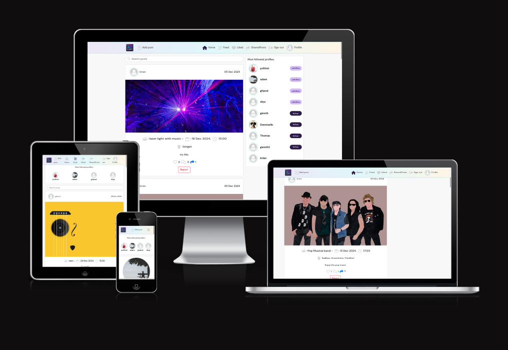 

## Table of contents

- [User Experience](#user-experience)
  - [Epics and User stories](#epics-and-user-stories)
- [Design](#design)
  - [Wireframes](#wireframes)
  - [Logo](#logo)
  - [Favicon](#favicon)
  - [Typography](#typography)
- [Structure](#structure)
- [Features](#features)
- [Reusable Components](#reusable-components)
- [Bugs](#bugs)
- [Technologies Used](#technologies-used)
  - [Languages](#languages)
  - [Tools](#tools)
  - [Frameworks](#frameworks)
  - [Libraries and modules](#libraries-and-modules)
- [Testing](#testing)
  - [Validator Testing](#validator-testing)
  - [Lighthouse Test](#lighthouse-test)
  - [Manual testing](#manual-testing)
  - [Browser Compatibility](#browser-compatibility)
  - [Automated Testing](#automated-testing)
- [Deployment](#deployment)
  - [Heroku](#heroku)
  - [Local deployment](#local-deployment)
  - [Forking this GitHub repository](#forking-this-github-repository)
  - [Clone this repository](#clone-this-repository)
- [Credits](#credits)
  - [Content](#content)
  - [Code](#code)
  - [ReadMe](#readme)
  - [Acknowledgments](#acknowledgments)

## User Experience

I used an Agile methodology approach to plan this project. This was implemented through the GitHub Project board with milestones, epics, user stories and tasks. Given the limited time frame, I've prioritized creating a broad overview of the project's features through high-level user stories, epics, and milestones. In a collaborative environment, I would delve into more granular user stories to ensure a comprehensive understanding of the requirements.
Each user story was classified with a label according to MoSCoW prioritization. 
The Kanban board can be seen [here](https://github.com/users/Pramilashanmugam/projects/7).

### Epics and User stories

*Groovemates* is designed for active individuals who love to connect and explore music. The platform offers the users to upload music events across and helps other user to get to know the information and likewise share with others. While it’s open to everyone, the primary focus is on those who loves music, socializing, and want to explore different joners of music. Groovemates helps users connect with like-minded people and enrich their social life. 

List of Epics:  

The project was divided into nine Epics, each containing the corresponding user stories: 
- Epic 1: Navigation and authentication
- Epic 2: Adding and liking Posts
- Epic 3: The Posts Page
- Epic 4: The Post Page
- Epic 5: The Profile Page
- Epic 6: Reporting a Post
- Epic 7: Reporting a Comment (was not implemented due to time constrain)
- Epic 8: Share a Post
- Epic 9: Followers and following

User Stories with their id:   

- As a user I can view a navbar from every page so that I can navigate easily between pages. [#1](https://github.com/Pramilashanmugam/groovemates_frontend/issues/1)
- As a user I can navigate through pages quickly so that I can view content seamlessly without page refresh [#2](https://github.com/Pramilashanmugam/groovemates_frontend/issues/2)
- As a user I can create a new account so that I can access all the features for signed up users [#3](https://github.com/Pramilashanmugam/groovemates_frontend/issues/3)
- As a user I can sign in to the app so that I can access functionality for logged in users [#4](https://github.com/Pramilashanmugam/groovemates_frontend/issues/4)
- As a user I can tell if I am logged in or not so that I can log in if I need to [#5](https://github.com/Pramilashanmugam/groovemates_frontend/issues/5)
- As a user I can maintain my logged-in status until I choose to log out so that my user experience is not compromised [#6](https://github.com/Pramilashanmugam/groovemates_frontend/issues/6)
- As a logged out user I can see sign in and sign up options so that I can sign in/sign up [#7](https://github.com/Pramilashanmugam/groovemates_frontend/issues/7)
- As a user I can view user's avatars so that I can easily identify users of the application [#8](https://github.com/Pramilashanmugam/groovemates_frontend/issues/8)
- As a logged in user I can create posts so that I can share my a music event with the world! [#9](https://github.com/Pramilashanmugam/groovemates_frontend/issues/9)
- As a user I can view the details of a single post so that I can learn more about it [#10](https://github.com/Pramilashanmugam/groovemates_frontend/issues/10)
- As a logged in user I can like a post so that I can show my support for the posts that interest me [#11](https://github.com/Pramilashanmugam/groovemates_frontend/issues/11)
- As a user I can view all the most recent posts, ordered by most recently created first so that I am up to date with the newest content [#12](https://github.com/Pramilashanmugam/groovemates_frontend/issues/12)
- As a user, I can search for posts with keywords, so that I can find the posts and user profiles I am most interested in. [#13](https://github.com/Pramilashanmugam/groovemates_frontend/issues/13)
- As a logged in user I can view the posts I liked so that I can find the posts I enjoy the most [#14](https://github.com/Pramilashanmugam/groovemates_frontend/issues/14)
- As a logged in user I can view content filtered by users I follow so that I can keep up to date with what they are posting about [#15](https://github.com/Pramilashanmugam/groovemates_frontend/issues/15)
- As a user I can keep scrolling through the images on the site, that are loaded for me automatically so that I don't have to click on "next page" etc [#16](https://github.com/Pramilashanmugam/groovemates_frontend/issues/16)
- As a user I can view the posts page so that I can read the comments about the post [#17](https://github.com/Pramilashanmugam/groovemates_frontend/issues/17)
- As a post owner I can edit my post title and description so that I can make corrections or update my post after it was created [#18](https://github.com/Pramilashanmugam/groovemates_frontend/issues/18)
- As a logged in user I can add comments to a post so that I can share my thoughts about the post [#19](https://github.com/Pramilashanmugam/groovemates_frontend/issues/19)
- As a user I can see how long ago a comment was made so that I know how old a comment is [#20](https://github.com/Pramilashanmugam/groovemates_frontend/issues/20)
- As a user I can read comments on posts so that I can read what other users think about the posts [#21](https://github.com/Pramilashanmugam/groovemates_frontend/issues/21)
- As an owner of a comment I can delete my comment so that I can control removal of my comment from the application [#22](https://github.com/Pramilashanmugam/groovemates_frontend/issues/22)
- As an owner of a comment I can edit my comment so that I can fix or update my existing comment [#23](https://github.com/Pramilashanmugam/groovemates_frontend/issues/23)
- As a user I can view other users profiles so that I can see their posts and get benefited by knowing the concerts happening [#24](https://github.com/Pramilashanmugam/groovemates_frontend/issues/24)
- As a user I can view statistics about a specific user: bio, number of posts, follows and users followed so that I can learn more about them [#26](https://github.com/Pramilashanmugam/groovemates_frontend/issues/26)
- As a user I can view all the posts by a specific user so that I can catch up on their latest posts, or decide I want to follow them [#28](https://github.com/Pramilashanmugam/groovemates_frontend/issues/28)
- As a logged in user I can edit my profile so that I can change my profile picture and bio [#29](https://github.com/Pramilashanmugam/groovemates_frontend/issues/29)
- As a logged in user I can update my username and password so that I can change my display name and keep my profile secure [#30](https://github.com/Pramilashanmugam/groovemates_frontend/issues/30)
- As a logged-in user, I can report a post so that I can bring attention to inappropriate or harmful content. [#31](https://github.com/Pramilashanmugam/groovemates_frontend/issues/31)
- As an admin, I can take action on a reported post (delete/ warn user, etc.) so that I can maintain a safe and respectful environment. [#32](https://github.com/Pramilashanmugam/groovemates_frontend/issues/32)
- As a logged-in user, I can report a comment so that I can alert the moderation team about potentially inappropriate interactions. [#33](https://github.com/Pramilashanmugam/groovemates_frontend/issues/33)
- As an admin, I can view reported comments and their details to assess whether they violate community guidelines and can take action on a reported comment (delete, warn user, etc.) [#34](https://github.com/Pramilashanmugam/groovemates_frontend/issues/34)
- As a logged-in user, I can share another user’s post to my own wall and also in a sharedpost page so that I can share content I find interesting with others. [#35](https://github.com/Pramilashanmugam/groovemates_frontend/issues/35)
- As a user, I want to have a dropdown to edit or delete my post so that I can use CRUD functionality on my Post. [#36](https://github.com/Pramilashanmugam/groovemates_frontend/issues/36)
- As a user, I can see a list of the most followed profiles so that I can see which profiles are popular. [#37](https://github.com/Pramilashanmugam/groovemates_frontend/issues/37)

## Design

### Wireframes

Due to lack of time, some of the originally planned features that can be seen on the wireframe had to be deleted or implemented differently.

 Home page 

 
Wireframe for home page for logged-out user:  

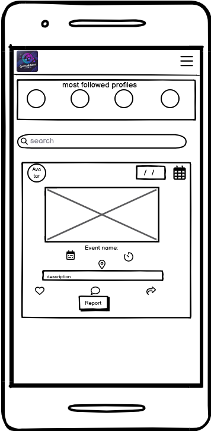 
 
Wireframes for home page for logged-in user:  
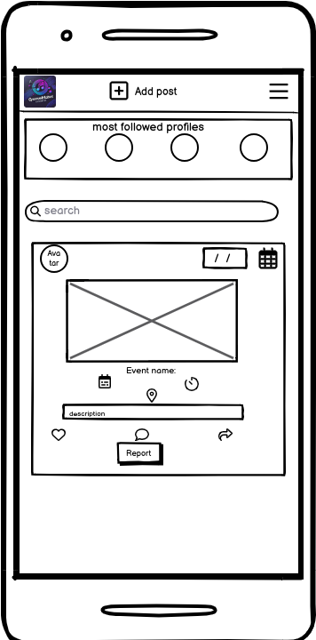 
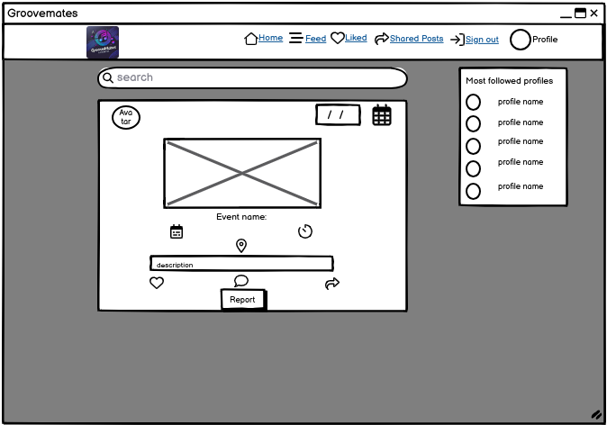 

 Sign up & Sign In 

 
User authentication was implemented using dj-rest-auth. This library provides a comprehensive set of features for user management, including registration, login, and logout functionalities.
For the final design of the authentication views, I utilized the Code Institute moments walkthrough design, which closely aligns with the wireframes originally created for the project. This approach ensured a consistent user experience throughout the application. 

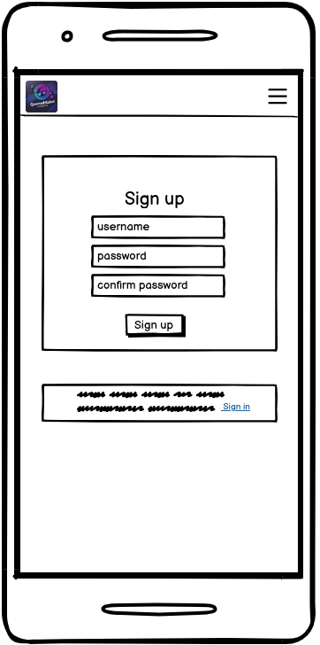 
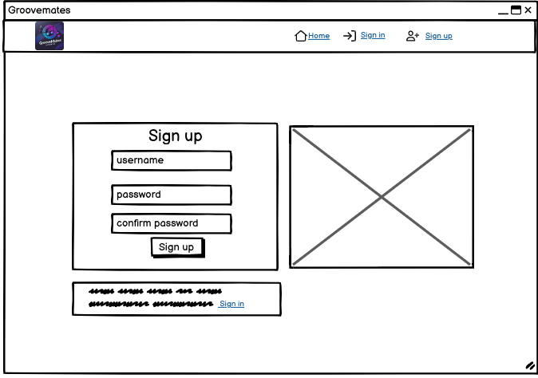 
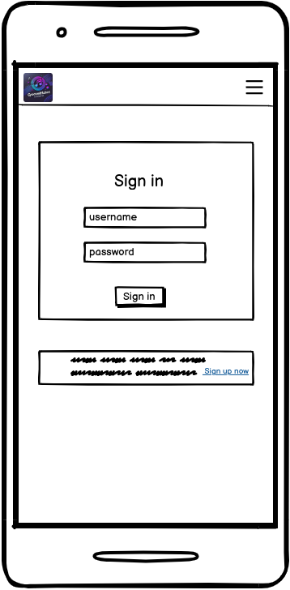 
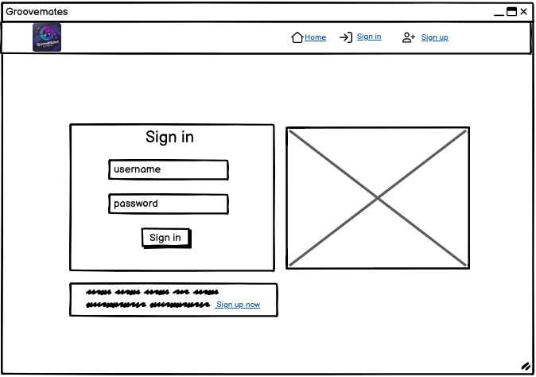 

 Create a Post 

 
To create a Post, a form was designed that closely resembles the one outlined in the wireframes. This form includes fields for all necessary information, ensuring a seamless user experience that aligns with the original design specifications. 

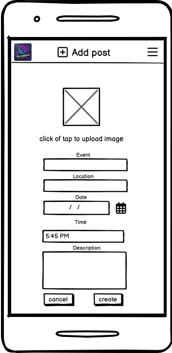 
 

 Profile Page 

 

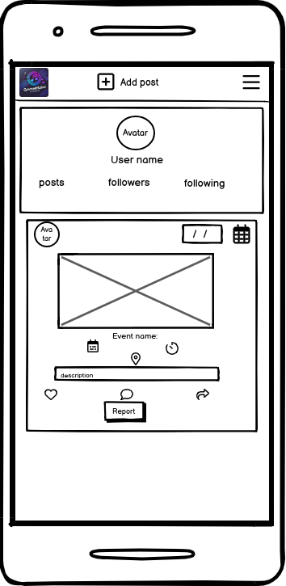 
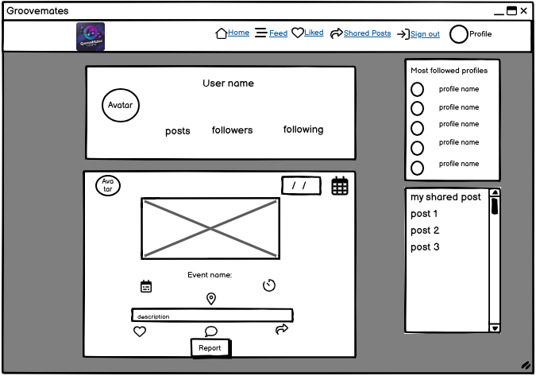 

### Imagery
 
The cat listening to music, which can be seen in the placeholder images in create a post, was found at Pexel.

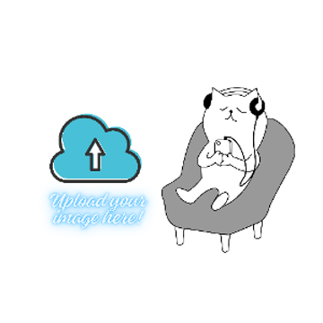 

#### Logo

The logo for "GrooveMates" has a modern and vibrant design, emphasizing a music-themed aesthetic. Here are its key features:

Color Scheme: It features a gradient of neon colors, predominantly pinks, purples, and blues, set against a dark background. This gives it a futuristic and energetic vibe.

Central Icon: A music note is at the heart of the design, symbolizing music and rhythm, enclosed within concentric circular lines that resemble sound waves or records.

Typography: The name "GrooveMates" is written in bold, modern font with "Alternative" in a smaller, more understated style. The font choice complements the music theme with a sleek and contemporary look.

Visual Effects: The logo incorporates dynamic elements like dots and lines, adding movement and vibrancy, suggestive of sound or pulsating beats.

Overall Design: The circular layout emphasizes inclusivity and community, aligning with the concept of connecting people through music.

It's a visually engaging design that perfectly captures the essence of a music-focused, modern brand.

 

#### Favicon

The favicon was created with [Favicon.io](https://favicon.io/favicon-generator/) by using the logos color theme and music note. 

 

#### Colour Scheme:

The color palette was created based on the neon colors of the logo text with [ColorSpace](https://mycolor.space/?hex=%23FF3131&sub=1). The navbar has the gradient pastel colours.

 Click here to see the colour palette 

 

I created this colour palette with [coloors](https://coolors.co/). 
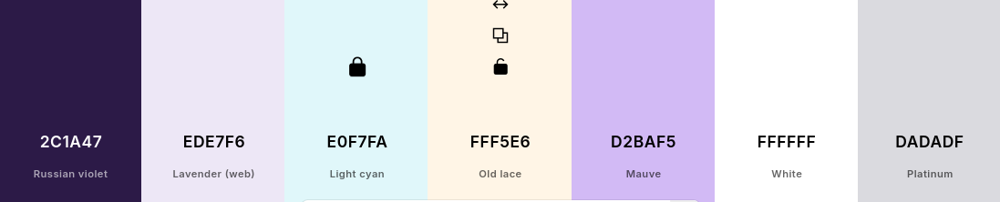 

### Typography

I have used "DM Sans", sans-serif font through out the project.

## Structure

All information about the structure can be found in the README of the API [here](https://github.com/Pramilashanmugam/GrooveMates_backend)

## Features

### Existing Features

To learn more about each feature, please click on the respective headline

 Header with logo and navbar 

 

To ensure uniformity and a sense of familiarity for users, all pages include the same header with navigation links depending on the authentication status of the user. 
The header consists of the logo, which is always arranged on the left and acts as a link to return to the main page. On the right side is the navigation bar, which turns into a clickable burger menu on smaller screens. Depending on whether the user is logged in or not, the navigation elements adapt accordingly. 
 

**For Logged-Out Users:** 
- *Home*: Redirects to the home page, displaying an overview of all active Groovemates posts from latest to old.  
- *Sign Up*: Takes the user to the registration page to create an account and begin interacting with the site.  
- *Log In*: Directs to the login page for returning users to access their accounts. 

**For Logged-In Users:**  
- *Home*: Same as the logged-out view, showing all active Posts.
- *Addpost*: Directs to the page where the user can create a new Post.
- *Feed*: Shows all posts of users who has been followed by the currentuser.
- *Liked*: Displays all the posts which was liked by the user.
- *Shared Posts*: It has all the posts which was shared by all other users.
- *Avatar/Profile*: It displays the number of followers, following, number of post uploaded by currentuser, on sidebar can view the shared post of only the current user.
- *Sign Out*: Allows the user to securely log out of their account.

 

View for users who are not logged in: 
  - Screenshot of header in mobile view: 
  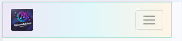 
  - Screenshot of header in mobile view with toggled navigation: 
  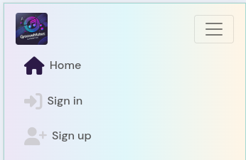 
  - Screenshot of header on larger screens: 
  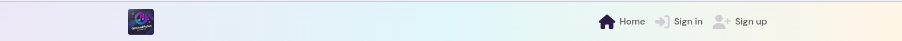 

  View for users who are logged in: 
  - Screenshot of header in mobile view: 
  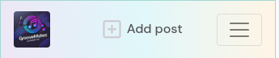 
  - Screenshot of header in mobile view with toggled navigation: 
  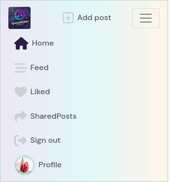 
  - Screenshot of header in desktop view: 
  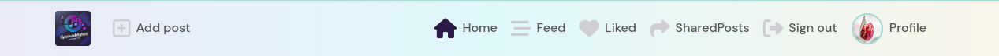 
 

 Favicon & Title

 

To create a consistent appearance, the logo, which appears in a square form with edges rounded in the navigation bar, was adapted into a background transparent version to create the favicon. 
Screenshot of the favicon: 
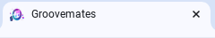 

 User authentication 

 

The user authentication system is implemented using the [dj-rest-auth](https://dj-rest-auth.readthedocs.io/en/latest/) framework, ensuring secure and reliable access to the site. This feature includes standard registration, login, and logout processes, with error handling and feedback tailored to match the application's design.  

**Sign Up** 
Users who are new to the site or have not yet created an account, can select the "Sign up" option from the Navigation Bar to register for a new user account. This process utilizes the standard dj-rest/auth/registration method for user account creation. After properly registering, the user will be redirected to the login page and a success message will be displayed for two seconds. 
Screenshot for Sign Up:  
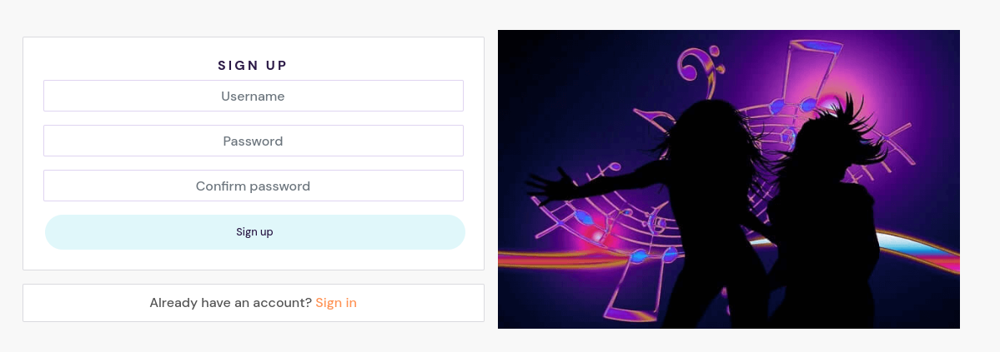 
Screenshot for Sign Up with Error message for username:  
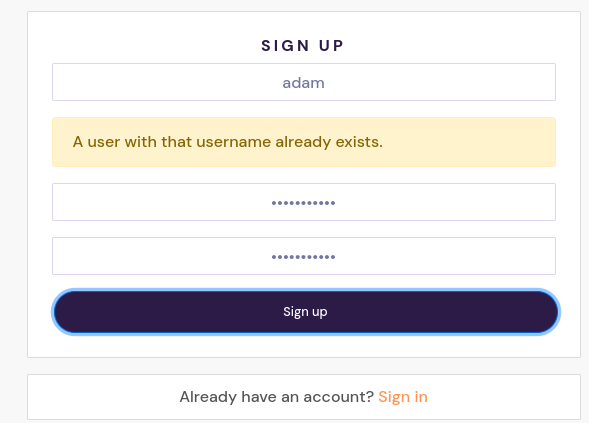 
Screenshot for Sign Up with Error message for password:  
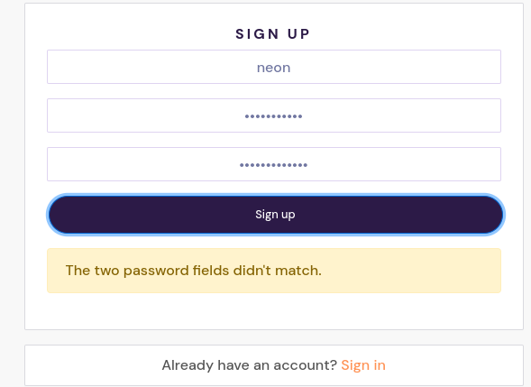 

**Sign in**  
Users who already have an account can click on the "Signin" option in the Navigation Bar to access their account. This page utilizes the standard dj-rest/auth/login method for user authentication. After the user correctly logs in, the user is redirected to the homepage, where an overview of all created Posts is shown. 
Screenshot for Log In:  
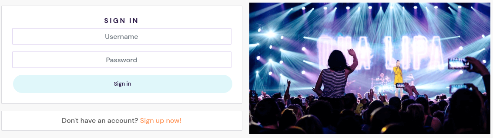 
Screenshot for Log In with error message:  
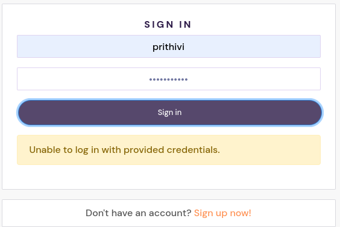 

**Sign Out** 
To Sign out, the user simply needs to click on the "Sign Out" option in the menu. Upon doing so, the user is successfully logged out via the /dj-rest-auth/logout/ endpoint, is redirected to the log-in page. 
Screenshot after signed out  
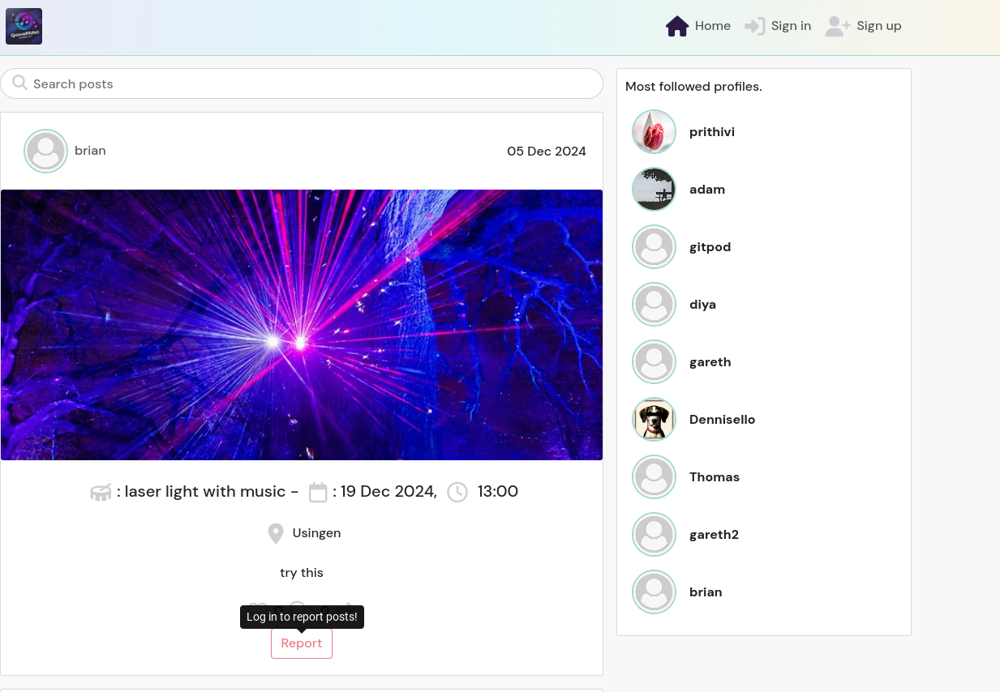 

 

 User Profile 

 

The user can access their profile only if logged-in through the navigation bar, from the "Most Popular Profiles" section (if they are listed there), or can say by clicking on the profile picture it will take you to profile page.  

The profile contains the following components: 
**Profile Picture**: If the user hasn’t uploaded a picture, a placeholder image of default avatar icon will appear throughout the site is shown. 
**Username**: The username that the user created during the signup process. 
**Follow/Unfollow button**: This button appears only if the user being viewed is not the currently logged-in user. 
**Overview of Posts**: Displays the number of Posts the user has currently created. 
**Followers and Following Counts**: Shows how many people are following the user and how many people the user is following. 
**"Bio" Description**: A personal description if the user has filled it out. 
**My Shared Posts**: A section on the sidebar where the user's Shared post will be displayed below the most followed profile. 

When a user creates a Post, the Post count on their profile increases. If the user follows or unfollows another user, the followers count on their profile will increase or decrease accordingly. Similarly, if another user follows or unfollows them, the following count will be updated. Additionally, the follow/unfollow button will change to reflect the current following status.
Below these components, there is an overview of all the Posts the user currently has online.If the user has created more than 10 Posts, additional Posts will continue to load as the user scrolls down (infinite scroll functionality). During this process, a spinner is briefly displayed to indicate that more content is being loaded. 
When a user visits their own profile, dropdown point towards left in grey appear on the right side. Clicking on these dropdown reveals a menu where the user can edit their profile, username, or password. Each option redirects the user to the corresponding form page for making the desired changes.  
When editing their profile, the user must ensure that the profile picture does not exceed 2 MB in size.
 

Screenshot of profile page(desktop view) after signing up: 
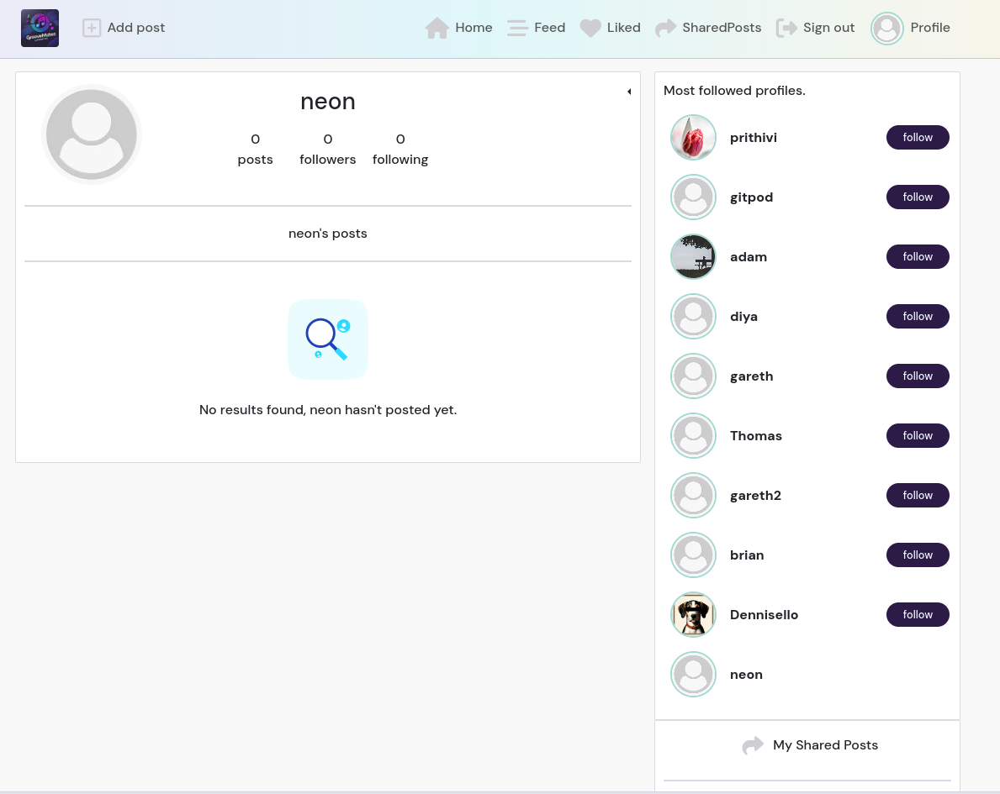 
Screenshot of profile page(mobile): 
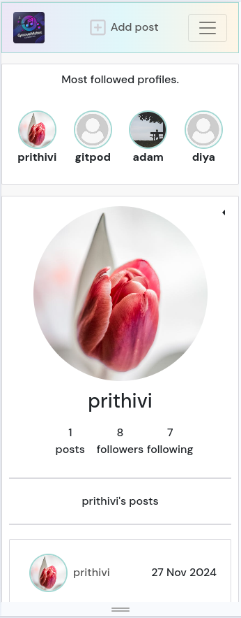 
Screenshot of profile page(desktop): 
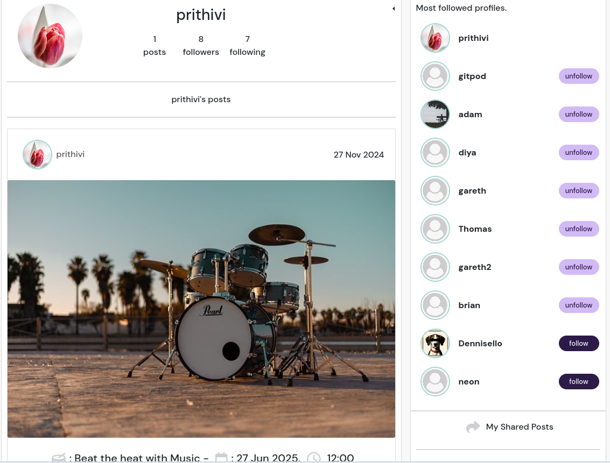 

**Edit a profile** 
Screenshot of profile edit button: 
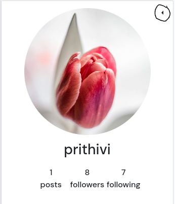 
Screenshot of profile page with edit menu(desktop): 
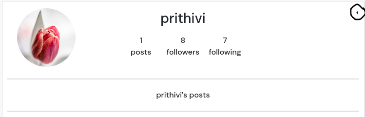 
Screenshot of profile page with edit menu(mobile): 
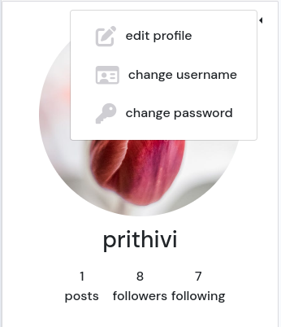 
Screenshot of edited username page: 
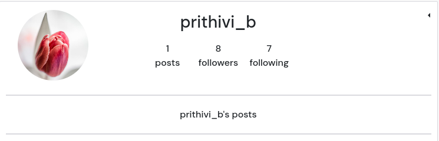 
Screenshot of error during editing username page:
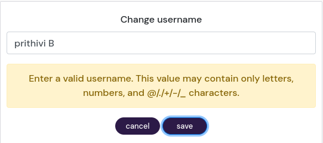 

**Edit username**  
Screenshot of edit password page: 
 

**Edit password** 
Screenshot of edit password page: 
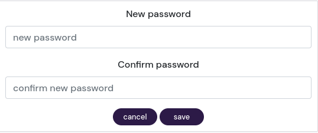 

 Post Management

 
Post Management includes the following topics: 

**Adding a new Post**: Users can create and submit new Posts through a designated form.
**Post Detail View**: Users can view detailed information about a specific Post by clicking on the title or the image in the Post card. 
**Editing or deleting an existing Post**: Users can modify or remove their existing Posts through an edit or delete option. 
**Overview of all existing Posts on Homepage**: The home page displays a comprehensive list of all available Posts. 
**Overview of Posts created by the user on their profile page**: Users can view a summary of all Posts they have created from their profile page. 
**Overview of liked Posts**: Users can access a list of Posts they have liked for quick reference. 
**Overview of Posts whom user following in Feed**: Users can view a list of Posts of the user who are being followed.   
**Overview of Posts on Shared posts**: Users can view a list of all shared Posts of all the users with the name of people who all have shared the post.  

 - **Adding a new Post** 
To add a Post, the user must sign up and log in. They can then navigate to the appropriate page via the navigation bar. All form fields are required except for the description. The date must be today or in the future. The user can upload an image for the Post. If no image is uploaded, a placeholder image will be shown instead.
If a required field is not filled out, an error message will be shown indicating which fields need to be completed. 
After the user clicks the 'Create' button and all required fields are correctly filled, they will be redirected to the detail page of this Post.  

Screenshot of 'add a Post' page: 
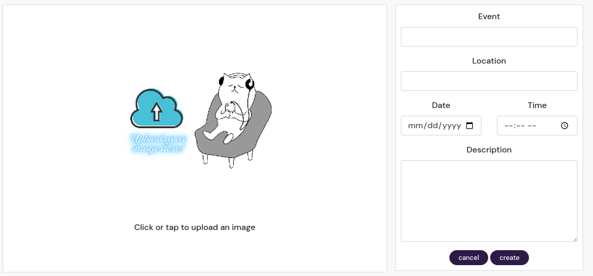 
Screenshot of error message for image larger than 2 MB: 
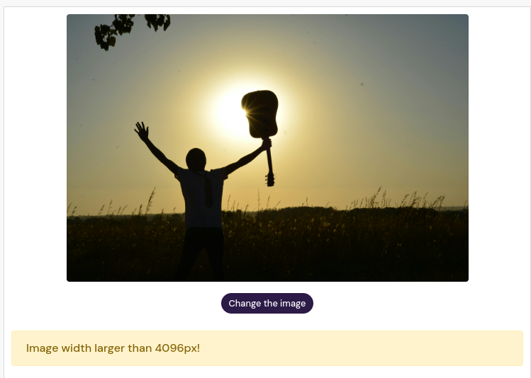 
Screenshot of error message for date validation: 
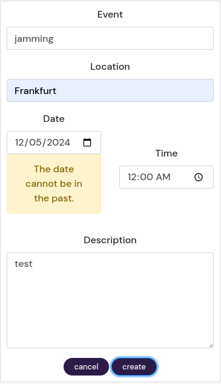 
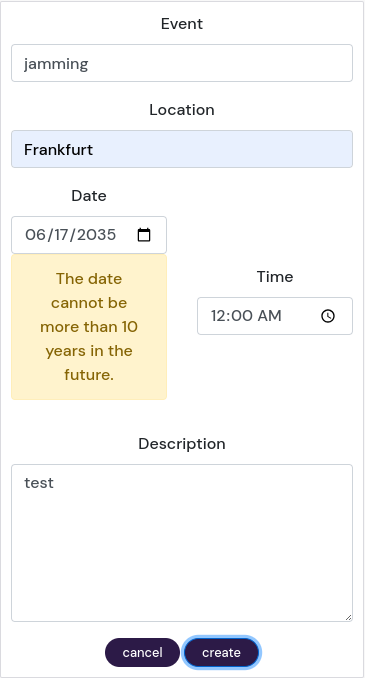 

- **Post detail view** 
A Post contains several elements in its detailed view. The following elements are included for the owner of the Post: 
  - *Event*: The title of the event.  
  - *Image*: The image associated with the Post or the placeholder image  
  - *Description*: A brief description of the Post, if given by the user.  
  - *Date, Time, and Location*: Details about when and where the Post will take place. 
  - *Last Updated*: Information on when the Post was last updated.  
Below these elements, there are three icons in a row with numbers next to each for counting:  
  - *Heart Icon*: Displays the number of likes. If the currently logged-in user has liked the Post, the heart will be filled with red. 
  - *Comment Icon*: Shows the number of comments associated with the Post. 
  - *share Icon*: Displays the number of shares. If the currently logged-in user click the share the icon will turn to blue. 
  - *Report button*: logged in user can report a post incase of spam, irrelevant. Submitted reports can be accessed only by admin any other user trying to view will get authentication required message.
Underneath these icons is the comments section. 

Screenshot of Post detail page for owner of the Post in mobile view, dropdown for edit appears: 
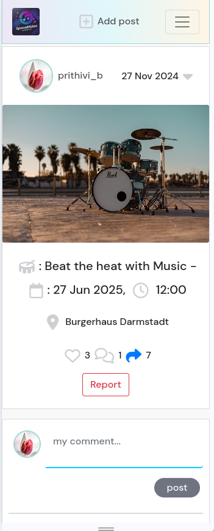 
Screenshot of Post detail page for other users of the Post in mobile view, dropdown for edit disppears: 
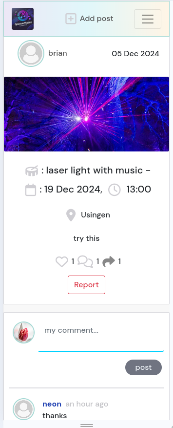 
Screenshot of Post detail page for owner of the Post in desktop view, dropdown for edit appears: 
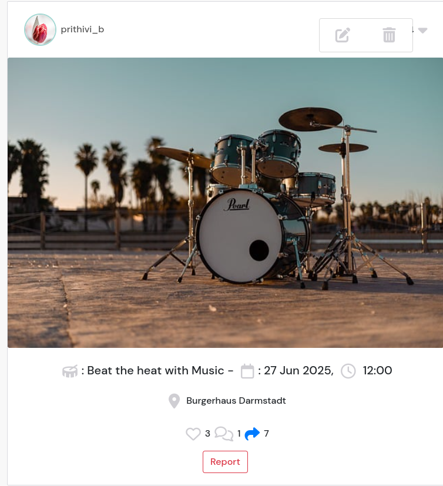 
Screenshot of Post detail for others of the Post in desktop view, dropdown for edit disappears: 
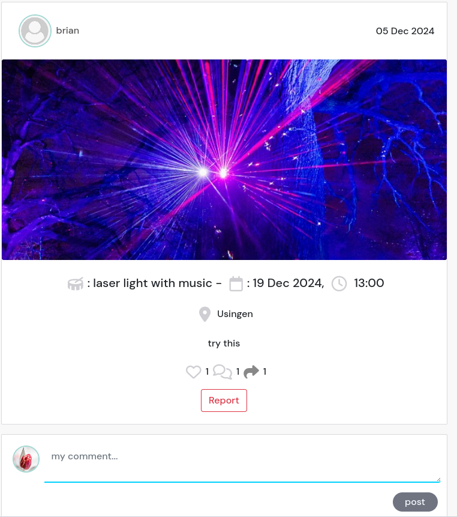 
Screenshot of edit option for a post.
 
 

- **Edit a Post** 
As part of the full CRUD functionality, the Post owner has the ability to edit the Post. When a user clicks the link to edit their Post, they are redirected to a form page where the existing data is already populated in the corresponding fields. The form retains the same validations as the "Create a Post" form, including image size limits (maximum 2 MB), required fields, and date validation (the date must be today or in the future). After the user clicks the "save" button, they are redirected to the Post's detail page where you can see the update post. 

Screenshot of post before edit 
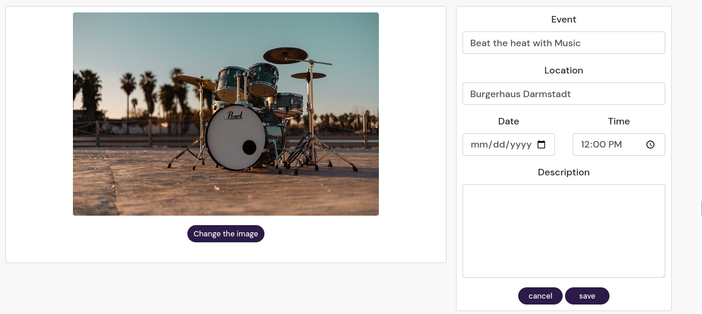 
Screenshot of post after edit: 
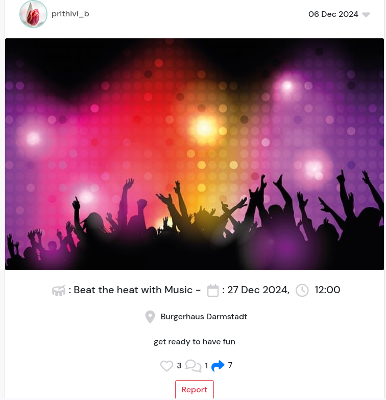 
Screenshot of validation message during edit: 
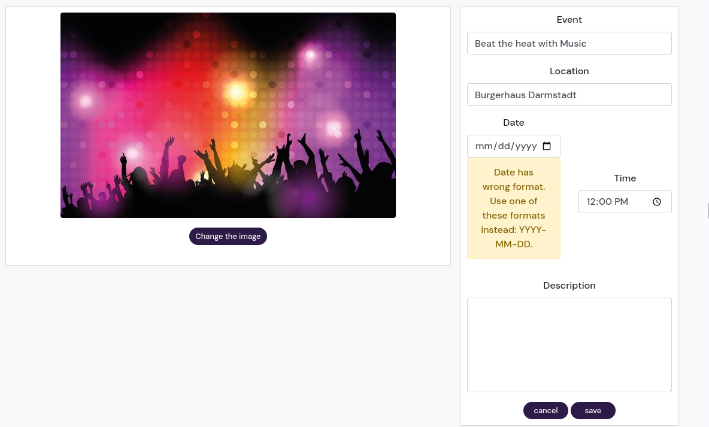 

- **Delete a Post** 
As part of the full CRUD functionality, the Post owner can delete a Post. This can be achieved from the Post overview by clicking on the dropdown icon as well as from the detail page of the Post. After successful deletion, the user is redirected back to the homepage and the corresponding Post is deleted from the database and the overview. 

Screenshot of delete icon on post 
 

- **Displaying an overview of all existing Posts on the Homepage.** 
The user can access the overview page of all Posts that have been created by clicking on the homepage. The user can access the overview page displaying all created Posts by clicking on the "Home" link in the navigation bar or by clicking on the logo. This page presents Posts sorted by the date they were added, with the most recent ones appearing first. Each Post is displayed in a card format that includes essential details such as the Event, description, date, time, location and counts of likes, shares, comments and report. Additionally, the last updated timestamp is shown. The overview page features infinite scroll functionality: when the user scrolls through 10 Posts, the next set of Posts is automatically loaded. During this process, a spinner is briefly displayed to indicate that more content is being loaded. 
In mobile view, the most active profiles are displayed above the Posts, while in desktop view, they are displayed alongside the Posts.
  

link for Post overview page  
[Click here to view Post Overview.](https://groovemates-frontend-b3335269700f.herokuapp.com/) 

- **Displaying an overview of liked Posts** 
When a user likes a Post by clicking on the heart icon within the Post card, they can later access an overview page of all their liked Posts. This page can be reached through the navigation bar by clicking on *liked*. The liked Posts are displayed similarly to those on the homepage overview, with each Post presented in a card format. This includes the event, description, date, time, location and counts of likes, shares, comments and report. The page also features infinite scroll functionality, where additional Posts are loaded after scrolling through the first 10 entries, with a brief display of a spinner indicating the loading process. In mobile view, the most active profiles are displayed above the Posts, while in desktop view, they are displayed alongside the Posts.  

- **Displaying an overview of Shared Posts** 
When a user clicks the share icon the share counts increases by one and the post will get posted on the Shared Post link which can be reached on the navigation bar. Users are restricted to share a Post only once, if they attempt to share more than once a message will displayed 'You've either just shared this post or already shared it before.'. The Shared Posts are displayed similarly to those on the homepage overview, with each Post presented in a card format, which includes the event, description, date, time, location and counts of shares, likes, comments and report, additionally it also show the list of user's name who have shared the post on top of the post. The page also features infinite scroll functionality, where additional Posts are loaded after scrolling through the first 10 entries, with a brief display of a spinner indicating the loading process. In mobile view, the most active profiles are displayed above the Posts, while in desktop view, they are displayed alongside the Posts.

- **Displaying an Overview of Posts from followed Users**  
As a user, you can view an overview of all Posts created by the users you follow. This page can be reached through the navigation bar by clicking the link  *Feed* in the Navbar. This page showcases Posts created by the followed users, presented in a card format similar to the homepage overview. Each card includes essential details such as the event, description, date, time, location and counts of shares, likes, comments and report.
The page supports infinite scroll functionality: after scrolling through the initial set of entries, more Posts will be loaded automatically, accompanied by a spinner indicating the loading process. On mobile devices, the Posts are displayed with the most active profiles shown prominently above them, while on desktop, these profiles are displayed alongside the Posts.

- **Displaying an overview of all Posts created by user** 
As already explained in the profile feature, all Posts created by the user are listed on their profile.

 User Interaction 

 
Users can interact with each other in the following ways:
- Commenting on a Post by going to the detailed view of the Post, which can also be accessed by clicking on the comment icon.
- Sharing the post shows the interest on the event and also helping in spreading the word.
- liking a Post by clicking on the heart icon.
- Follow/Unfollow functionality by clicking on the Follow/Unfollow button, which is available in the "Most followed profiles" section, the shared posts, and the profile overview. This option is only available when the logged-in user is not viewing their own profile.  
 

**share and like Icons**:  
The icons representing share (sharing arrow icon) and likes (heart icon) dynamically change based on the user's status: 
- *share*: When the user clicks on the share icon, it toggles their share status. If the user is has shared a post, the icon will change to blue colour and the share count gets increased accordingly. Users are restricted to share a Post only once. 
- *likes*: When the user clicks on the heart icon, it toggles the like status of the Post. If the user has likeed the Post, the heart icon will turn red, and the like count will increase accordingly. 

**Report Button:**
The Report button is for the user to inform the admin about a post if it is not relevant to the website goal. On clicking the button, a form containing the reasons for the report and description is available. User can choose the reason from dropdown and share their reasons in description and then submit. On Submit, user gets a confirmation that the report will be reviewed by admin.

Screenshot of Report button on post for logged in user 
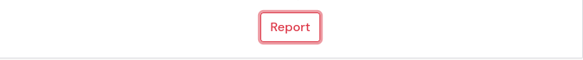 
Screenshot of Report button on post for logged out user 
 
Screenshot of Report Form 
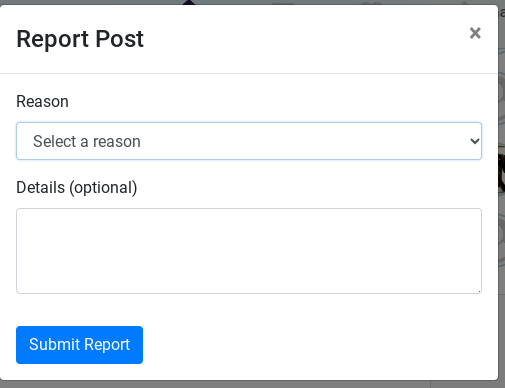 
Screenshot of Report Reasons dropdown 
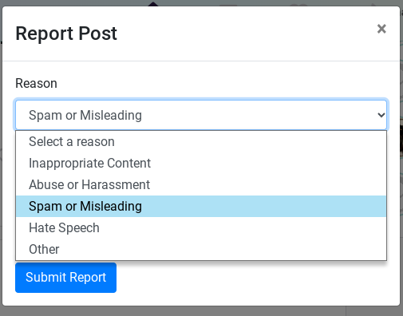 
Screenshot of Report confirmation message on submit 
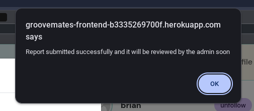 

**Comment Section:**
Users can interact with the Post by adding comments:  

The user's profile image is displayed next to the comment form field. After entering a comment and clicking the "post" button, the comment is displayed under the Post in a list format. Each comment includes the commenter's profile image, the time when the comment was added, and the comment content.
If the currently logged-in user is the owner of the comment, dropdown icon appear next to the comment, providing options to edit or delete the comment.  
- *Edit*: When the user clicks "Edit" on their comment, the comment form reopens with the existing content. The user can then update the comment and save the changes. Alternatively, they can cancel the edit, which will close the form, leaving the comment unchanged.  
- *Delete*: When the user clicks "Delete" on their comment. Upon confirming the deletion, the comment is removed from the list.

Screenshot of comment icon on post 
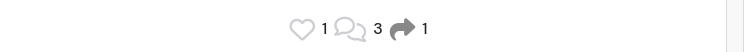 
Screenshot of comment form 
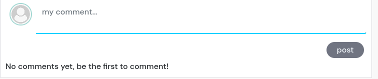 
Screenshot of list of comments 
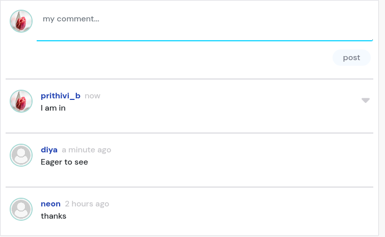 
Screenshot of edit/delete option for a comment 
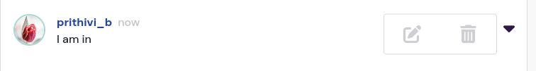 

details>

 404 - Not Found page 

 

A dedicated 404 error page has been created to handle instances where users navigate to a non-existent page. The page features a placeholder image of maginifying glass searching to indicate that the requested page could not be found. Below the image, there is a short message: "Sorry, the page you are looking for doesn't exists". 

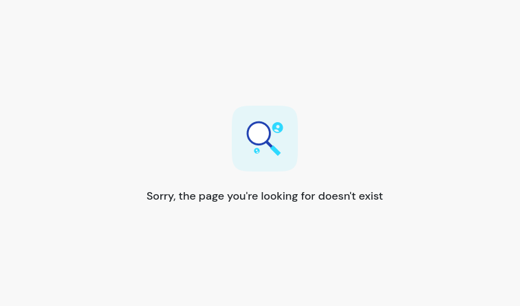 

### Features, which I would like to implement in the future

- *Delete a Profile*: Allow users to permanently delete their profiles from the platform. This feature will include necessary confirmations and safeguards to prevent accidental deletions. 
- *Nested Comments*: I have already included the required fields in backend api to create a nested comments, due to time constraint i was unable to complete the implementation and would like to implement in the near future.
- *Confirmation messages*: success messages for all the functionality like delete, updated etc
- *Delete the outdated posts*: Want to implement the outdated posts to keep the post page more lively.
- *Live Location*: Want to implement the live location using map on post location field.

## Reusable Components

Reusable components are a core principle in React, enabling developers to write modular, maintainable, and efficient code. Examples of reusable components in this project: 

**Assets.js** 
 This component is designed to handle the display of a loading spinner, an image, or a message, depending on the props passed to it.  
It was utilized in various parts of the application. Here's how it was employed across different components:
- PostCreateForm: To display a placeholder image encouraging the user to upload one, accompanied by a message.
- PostPage: To load the spinner while the Post content is being retrieved.
- PostsPage: To load the spinner during data retrieval and display a placeholder image with a corresponding message when no Posts could be found.
- PopularProfiles: To display a spinner while the user profiles are being loaded.
- SharedPosts: To load the spinner while the shared Post content is being retrieved.
- ProfileSharedPosts: To load the spinner while the shared Post content is being retrieved.
- ProfilePage: To load the spinner during profile retrieval and to display a placeholder image if the user hasn't created any Posts yet.

This widespread usage highlights the Asset component's role in providing consistent visual feedback and handling various states, such as loading and empty data scenarios, across the application. 

**Avatar.js** 
The Avatar component was utilized across various parts of the application to ensure a consistent and user-friendly display of profile images and related text. Here's how it was implemented in different components:
- Profile: Displayed the user's avatar
- Comments Section: Displayed avatars next to each comment, allowing users to visually connect comments with the respective user.
- Most followed Profiles Component: Highlighted active users' avatars, making it easy to recognize frequent contributors and follow/unfollow them.
This component was crucial in maintaining a consistent and polished appearance across different parts of the application, ensuring that user avatars were displayed effectively in various contexts.

**MoreDropdown.js** 
The MoreDropdown component is designed to provide users with quick access to editing or deleting content within the application. This component utilizes Bootstrap's Dropdown.  
The *ProfilePage, Comment, Post* extends the functionality of the *MoreDropdown* by offering component-specific actions. This component provides options to edit/Delete option in various components like ProfilePage/Post/Comments, for example in ProfilePage user can change the username, or update the password. Each option redirects the user to the appropriate editing page, leveraging React Router's useNavigate hook for seamless navigation.  
The MoreDropdown component enhances user experience by providing a consistent and intuitive way to manage content and profiles within the application, making it easy to access essential editing and deletion functionalities while ensuring that any critical actions are thoroughly confirmed before being executed. 

**NavBar.js** 
The Navbar component played a central role in the application's navigation, offering a consistent and intuitive user experience across the site. It was designed to adapt dynamically based on the user's authentication status, providing access to relevant features and pages. 

**NotFound.js** 
The NotFound component is a specialized component designed to handle 404 errors, providing users with a clear indication that the page they are trying to access does not exist.

## Bugs and Fixes

Known bugs are resolved or an alternative solution been identified and fixed. However there could also be unknown bugs, which was not discovered during the rigorous testings.

 500 error 

 
Due to Typo error on the backend the sharedpost function was throwing 500 error in frontend, this was fixed after correcting the typo error in the api. See the pictures below
 

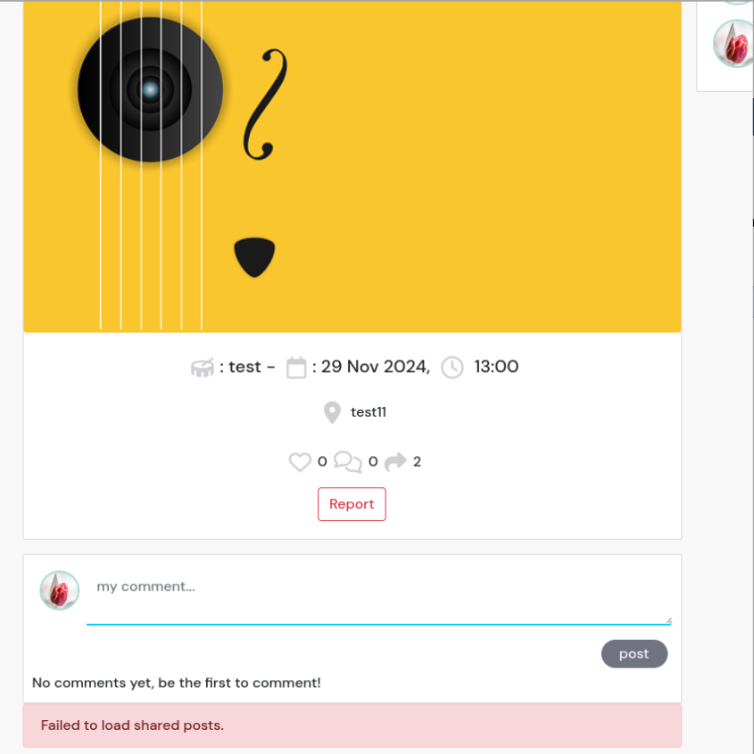 
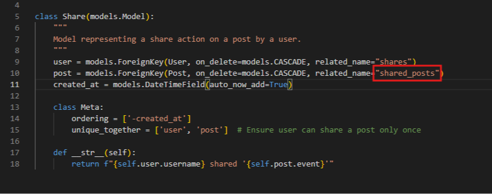 
 

 Signin/Signout error 

 
The user where not getting logout despite clicking the signout button, the issue was lying in the backend drf_api/urls.py. The path('dj-rest-auth/logout/', logout_route) was placed on the wrong line, after shifting to the correct line the issue got resolved.
 

 
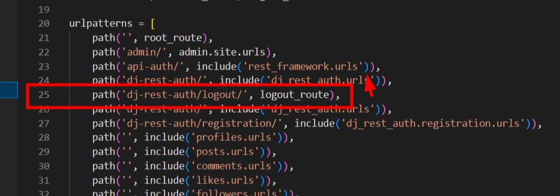 

 Like count was not displayed 

 
On clicking like button, instead of displaying the number of count it was displaying NaN  or no value. The issue was lying in the post serializers, i had not mentioned the like_count in the Meta, issue was resolved after including the like_count field.
 

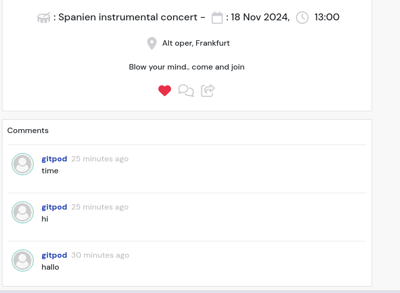 
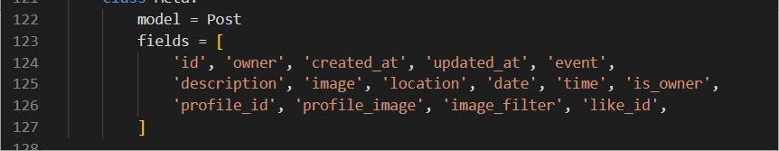 

 Logical errors while implementing shared post and profilesharedpost components 

 
Implementing share component was very challenging there were many challenges like getting the correct name of the shared user on the correct post, had to face lot of struggle in getting things right. Lots of trial and errors conducted that had no enough time to document them all. Issue was resolved by getting the shared_by field as arrays. By serializing post using Primarykeyrelatedfield had solved the issue in the shareserializer backend.

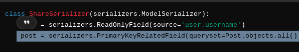 

 On click Like/Share icons in Sharepost throw Typeerror

 
On clicking like and share icons on Sharepost page it displayed the Typeerror, The error was on line number 84 in SharedPosts.js "Post {...post}"  this was fixed by changing the code to "Post {...post} setPosts={setSharedPosts}" however the like, Share icon was giving the result as expected it was throwing NaN error instead of displaying the count of likes and share. This issue was lying at the backend as the sharedpost api end point was not receiving the like_count, Comment_count and share_count. By updating the necessary changes in posts/serializers.py in backend has resolved this issue.  

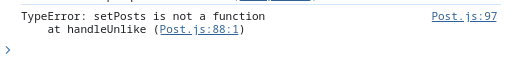 

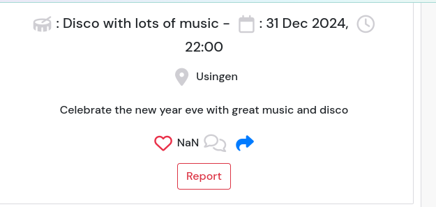 
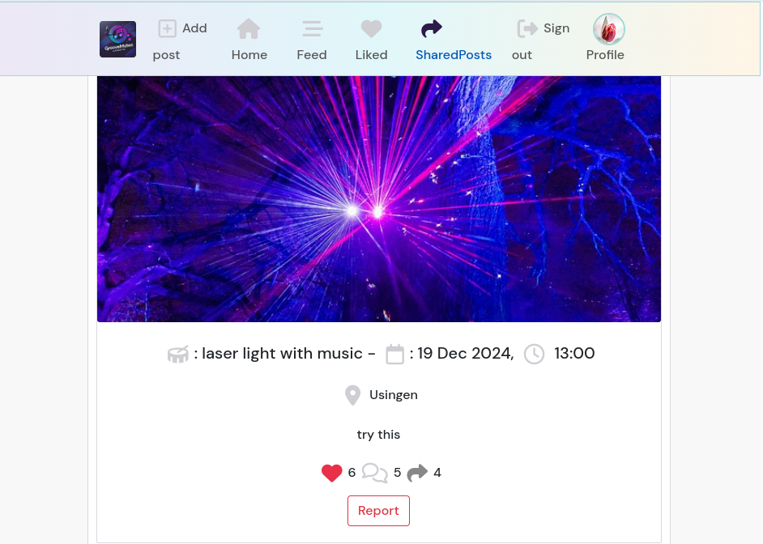 

Changes made in Backend sharedpost api endpoint, reason for the fix

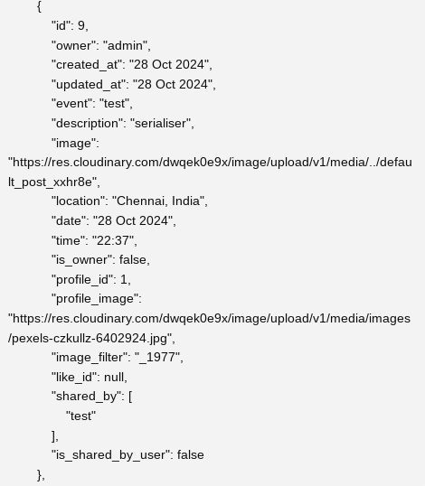 
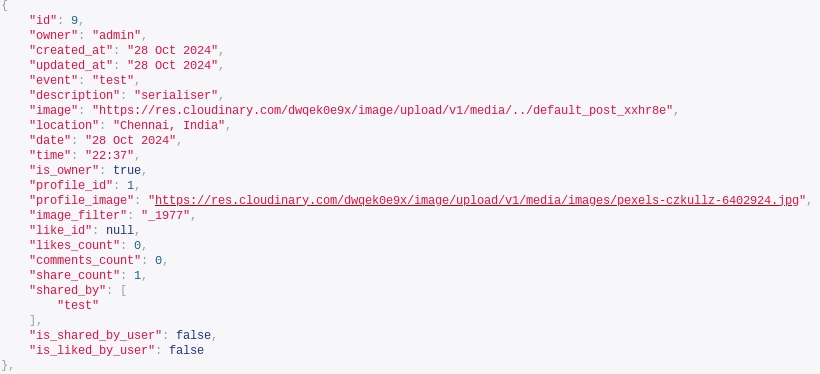 

## Technologies Used

### Languages:
- [CSS](https://en.wikipedia.org/wiki/CSS)
- [JavaScript](https://www.javascript.com/)
- [JSX](https://de.legacy.reactjs.org/docs/introducing-jsx.html)

### Tools:
- [Git](https://git-scm.com/) was used for version control by utilizing the Gitpod terminal to commit to Git and Push to GitHub.
- [GitHub](https://github.com/) was used to save and store the files for the website.
- [Heroku](https://www.heroku.com) was used to deploy the application.
- [CodeInstitute IDE - Gitpod](https://codeinstitute-ide.net/) was used as IDE. 
- [Code Insitute Database Maker](https://dbs.ci-dbs.net/) PostgreSQL database hosting for this project
- [Fontawesome](https://fontawesome.com/) was used to add icons to the website.
- [Balsamiq](https://balsamiq.com/) was used to create the wireframes.
- [Coloors](https://coolors.co/image-picker) was used to create the colour scheme.
- [Convertio](https://convertio.co/) was used to convert jpg images into png images.
- [tinypng](https://tinypng.com/) was used to reduce the image sizes.
- [Pixabay](https://www.pixabay.com/de-de/) was used to search and load images
- [Browserling](https://www.browserling.com/) was used to test the application on different browsers.
- [Cloudinary](https://cloudinary.com/) was used to store the images for Posts and profiles.
- [Canva](https://www.canva.com/) was used to create the logo, and the placeholder images.
- [Favicon.io](https://favicon.io/favicon-generator/) was used to create the favicon.
- [Google Chrome Dev Tools](https://developer.chrome.com/docs/devtools?hl=de) were used to check the application for responsiveness and errors.

### Frameworks: 
- [React](https://react.dev/)
- [React Bootstrap](https://react-bootstrap.netlify.app/)
- [React Router Dom](https://reactrouter.com/en/main)

### Libraries and modules:
- [Axios](https://axios-http.com/docs/intro)
- [React Infinite Scroll Component](https://www.npmjs.com/package/react-infinite-scroll-component)
- [Moment](https://momentjs.com/)
- [Mock Service Worker](https://mswjs.io/)

## Testing

The app was tested regularly and deployed early to Heroku to make sure both local and remote worked the same.

### Validator Testing

 HTML Validation

 

I passed my deployed html files through the [HTML Validator](https://validator.w3.org/) and no errors were found. 
     
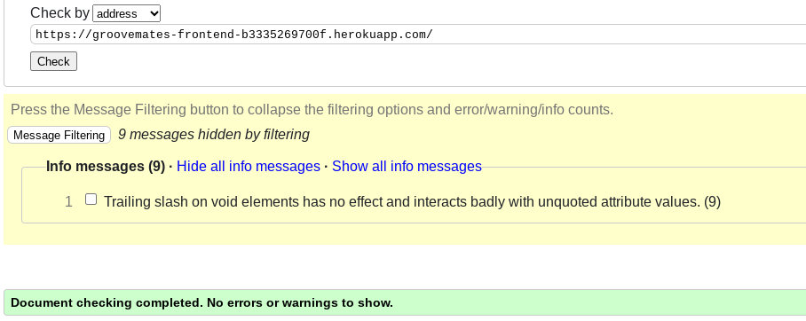 
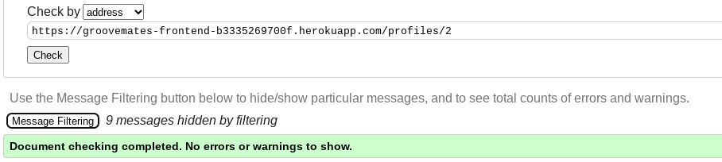 
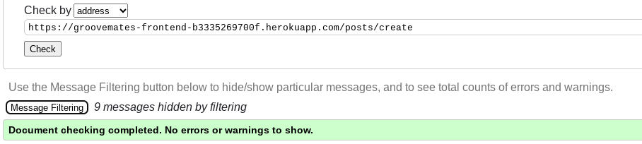 
 
 
 
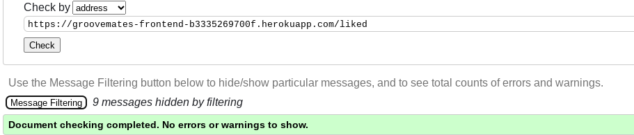 
  

 CSS Validation

 

I passed my deployed css file through the [CSS Validator](https://jigsaw.w3.org/css-validator/) and no errors were found. 
     
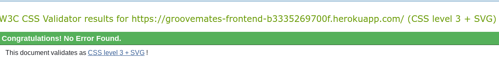
  

 JavaScript Validation - ESLint

 

To validate the Javascript code in my code editor I used [ESLint](https://eslint.org/). Several minor issues were immediately corrected and no errors or warnings were shown. 
 
  

### Lighthouse Test
I used Google Lighthouse in Chrome Developer Tools to test the pages for Performance, Accessibility, Best Practices and SEO for mobile view. The large image size downgraded my performance score and third party cookies downgrades the bestpractices. Overall, this is something I would like to improve in the future with more time. 

Home page:  
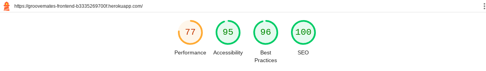 
Add(Create a Post): 
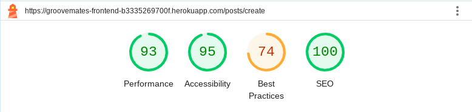 
Profile: 
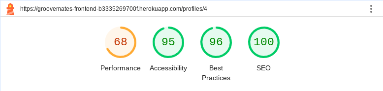 

### Manual Testing

 Click here to see the testing table for features

 

| Test                                                                      | Test Description                                                                                                                                      | Expected Outcome                                                                                                                                                                                                                                                                                           | Result |
| ------------------------------------------------------------------------- | ----------------------------------------------------------------------------------------------------------------------------------------------------- | ---------------------------------------------------------------------------------------------------------------------------------------------------------------------------------------------------------------------------------------------------------------------------------------------------------- | ------ |
| Header - Logo                                                             | Click on the logo to return to main page                                                                                                              | Clicking on the logo on each page will return you to the main page                                                                                                                                                                                                                                         | Pass   |
| Header - Navbar toggle in tablet/mobile view                              | Click in tablet/mobile view on the burger icon to open the navigation                                                                                 | When the burger icon in mobile or tablet view is clicked, the navigation should open                                                                                                                                                                                                                       | Pass   |
| Header - Close Navbar toggle in tablet/mobile view                        | Click outside of the toggeld navbar in tablet/mobile view                                                                                             | When clicking outside of the toggled navbar, the navbar should dissapear and the burger icon should be shown                                                                                                                                                                                               | Pass   |
| Header - Navbar toggle inside the menu in tablet/mobile view              | Click in tablet/mobile view on the burger icon to open the navigation and then click on Posts                                                         | When the user clicks Posts in mobile or tablet view, the dropdown should open                                                                                                                                                                                                                              | Pass   |
| Header - Navigation link                                                  | Click on a term in the navigation bar to go to the corresponding page                                                                                 | Clicking on a page at the navigation bar should take the user to the corresponding page                                                                                                                                                                                                                    | Pass   |
| Header - Navigation link (mobile view)                                     | Click in the mobile view on a term in the navigation bar to go to the corresponding page and close the toggled burger menu                            | Clicking on a page at the navigation bar should take the user to the corresponding page and close the toggled burger menu                                                                                                                                                                                  | Pass   |
| Header - Navigation links and items                                       | Depending on whether the user is logged in or not, the navigation elements should adapt accordingly                                                   | After logging in, the navigation menu should adjust accordingly.                                                                                                                                                                                                                                           | Pass   |
| Favicon & Title                                                           | When opening the page or navigating within it, the favicon and the title should be visible.                                                           | After opening the page or navigating within it, tha favicon should be visible.                                                                                                                                                                                                                             | Pass   |
| Sign Up                                                                   | Fill out each field and click on the sign up button.                                                                                                  | After filling out every form field with validate input, and clicking the 'Sign Up' button, the user should be redirected to sign in page                                                                                                                                                                   | Pass   |
| Sign Up - error message                                                   | Fill the username field with a username that is already existing or a password that didn't match, and click on the signup button.                     | After entering a username that already exists or a password that doesn't match, and clicking the "sign up" button, an error message should be displayed.                                                                                                                                                   | Pass   |
| Sign In                                                                   | Sign in with username and password                                                                                                                    | Clicking on the 'Sign In' button after providing the correct username and password, the user should be redirected to the main page, and the navigation menu should change.                                                                                                                                 | Pass   |
| Sign out                                                                  | Click 'Sign out' in the navigation bar                                                                                                                | After clicking on Sign out, the user is logged out, redirected to the log in page, the navigation bar for logged out users is shown. click on report button, a message shows please log in to report should appear                                                                                         | Pass   |
| Redirect Logged In - Signup/Signin                                        | Manually enter the URL for the Signup or Signin page in the browser while logged in.                                                                  | The user is redirected to the homepage, and the Signup/Signin page is not accessible.                                                                                                                                                                                                                      | Pass   |
| Redirect Signed out - Profile Page                                        | Manually enter the URL for the user profile page in the browser while logged out.                                                                     | The user is redirected to the homepage, and the profile page is not accessible.                                                                                                                                                                                                                            | Pass   |
| Redirect Logged out - Post Page                                           | Manually enter the URL for a Post page in the browser while logged out.                                                                               | The user is redirected to the homepage, and the Post page is not accessible.                                                                                                                                                                                                                               | Pass   |
| User Profile Access - Logged In                                           | Access the profile page via the navigation bar, "Most Followed Profiles" section, or comments section by clicking on the username or profile picture. | The user should be able to access their profile page.                                                                                                                                                                                                                                                      | Pass   |
| Profile Picture Display                                                   | Access the profile page where the user has not uploaded a picture.                                                                                    | A default image icon of a person should be displayed.                                                                                                                                                                                                                                                      | Pass   |
| Username Display                                                          | Access the profile page.                                                                                                                              | The username displayed should be the one created during the signup process.                                                                                                                                                                                                                                | Pass   |
| Follow/Unfollow Button Visibility                                         | Access the profile page of a user who is not the currently logged-in user.                                                                            | The follow/unfollow button should be visible. Access the profile page of the logged-in user.                                                                                                                                                                                                               | Pass   |
| Profile page - overview of Posts                                          | Access the profile page.                                                                                                                              | The number of Posts the user has created should be displayed accurately.                                                                                                                                                                                                                                   | Pass   |
| Followers and Following Counts                                            | Access the profile page.                                                                                                                              | The number of followers and the number of people the user is following should be displayed accurately.                                                                                                                                                                                                     | Pass   |
| Bio Description                                                           | Access the profile page where the user has provided a description.                                                                                    | The description should be displayed if it is filled out.                                                                                                                                                                                                                                                   | Pass   |
| Infinite Scroll for Posts                                                 | Access a Post page with more than 10 Posts and scroll down.                                                                                           | Additional Posts should load as the user scrolls, and a spinner should be briefly displayed during loading.                                                                                                                                                                                                | Pass   |
| Edit Profile Button - Own Profile                                         | Visit own profile page.                                                                                                                               | Clicking the dropdown should reveal a dropdown menu with options to edit profile, username, or password.                                                                                                                                                                                                   | Pass   |
| Redirect to Edit Profile Page                                             | Click on 'Edit Profile' from the dropdown menu.                                                                                                       | The user should be redirected to the edit profile page with existing data pre-filled in the form.                                                                                                                                                                                                          | Pass   |
| Confirm Profile Changes                                                   | On the edit profile page, click 'Confirm Changes'.                                                                                                    | The user should be redirected back to the profile overview page, and should be able to view the updated changes                                                                                                                                                                                            | Pass   |
| Profile Picture Size Validation                                           | On the edit profile page, upload an image larger than 2 MB.                                                                                           | The system should reject the upload with an appropriate error message.                                                                                                                                                                                                                                     | Pass   |
| Add a new Post Page - Log In Required                                     | Click on the navigation bar link 'Add post' , it should redirect you to 'Create a new Post' page.                                                     | After clicking the link, the user should be directed to the 'Create a new Post' page.                                                                                                                                                                                                                      | Pass   |
| Required Fields - error message                                           | On the 'Create a new Post' page, leave one or more required fields empty and attempt to submit the form.                                              | An error message should be displayed indicating which required fields are missing.                                                                                                                                                                                                                         | Pass   |
| Date field validation                                                     | On the 'Create a new Post' page, enter a date that is past the current date or more than 10years in future and try to submit the form.                | The system should reject the date with an appropriate error message.                                                                                                                                                                                                                                       | Pass   |
| Image upload - less than 2 MB                                             | On the 'Create a New Post' page, upload an image less than 2 MB and submit the form.                                                                  | The uploaded image should be displayed as part of the Post.                                                                                                                                                                                                                                                | Pass   |
| Image Upload - more than 2 MB                                             | On the 'Create a New Post' page, upload an image larger than 2 MB and try to submit the form.                                                         | An error message should be displayed indicating that the image size exceeds the limit.                                                                                                                                                                                                                     | Pass   |
| Placeholder Image                                                         | On the 'Create a new Post' page, do not upload an image and submit the form.                                                                          | An error message should throw saying submitted data is not a file and the post should not get created.                                                                                                                                                                                                                                        | Pass   |
| Successful creation - redirection and success message                     | Filling out all required fields correctly on the 'Create a New Post' page and click the 'Create' button.                                              | The user should be redirected to the detail page of the Post, and the post page should be display the new post.                                                                                                                                                                                            | Pass   |
| Edit Post - Prevent unauthorized URL access for editing                   | Open the Post edit URL without logging in or as a user who is a non-owner of the Post                                                                 | Redirected to home page                                                                                                                                                                                                                                                                                    | Pass   |
| Post detail view - Event display                                          | View the Post detail page                                                                                                                             | The title of the Post should be displayed correctly at the top of the detail page                                                                                                                                                                                                                          | Pass   |
| Post detail view - creator information                                    | View the Post detail page                                                                                                                             | The username of the creator should be displayed with a clickable avatar link to their profile                                                                                                                                                                                                              | Pass   |
| Post detail view - image display                                          | View the Post detail page                                                                                                                             | The associated image or placeholder image should be displayed correctly                                                                                                                                                                                                                                    | Pass   |
| Post detail view - Description Display                                    | View the Post detail page                                                                                                                             | The description should be displayed if provided, or no description section if not provided                                                                                                                                                                                                                 | Pass   |
| Post detail view - date, time, and location display                       | View the Post detail page                                                                                                                             | The correct date, time, and location of the Post should be displayed                                                                                                                                                                                                                                       | Pass   |
| Post detail view - heart icon (like count)                                | View the Post detail page as a logged-in user                                                                                                         | The heart icon should display the correct number of likes, filled with red if the user has liked the Post                                                                                                                                                                                                  | Pass   |
| Post detail view - share icon (Share count)                               | View the Post detail page as a logged-in user                                                                                                         | The share icon should display the correct number of shares, filled with blue if user has shared a post                                                                                                                                                                                                     | Pass   |
| Post detail view - share icon (restrict a user to share a post only once) | View the Post detail page as a logged-in user                                                                                                         | The share icon should display a message "sorry, you cannot share a post more than once" if the user already shared once. If not on hover a message saying "click to share" should appear                                                                                                                   | Pass   |
| Post detail view - share icon (Share accessability)                       | View the Post detail page as a logged-out user                                                                                                        | On clicking share icon, user should get a message that he needs to login to share a post                                                                                                                                                                                                                   | Pass   |
| Post detail view - comment icon (comment count)                           | View the Post detail page                                                                                                                             | The comment icon should display the correct number of comments associated with the Post                                                                                                                                                                                                                    | Pass   |
| Post detail view - comments section display                               | View the Post detail page                                                                                                                             | The comments section should be displayed correctly below the icons                                                                                                                                                                                                                                         | Pass   |
| Post detail view - Report button                                          | View the Post detail page as a logged-in user                                                                                                         | On clicking report button, user should be redirected to a form to create a report                                                                                                                                                                                                                          | Pass   |
| Post detail view - Report button form submission                          | View the Post detail page as a logged-in user                                                                                                         | on creating a report when user submit the form, user should get a success message on report submission                                                                                                                                                                                                     | Pass   |
| Post detail view - Report button                                          | View the Post detail page as a logged-out user                                                                                                        | On clicking report button, user should get a message that he needs to login to create a report                                                                                                                                                                                                             | Pass   |
| Post detail view - edit/delete options for owner                          | View the Post detail page as the owner                                                                                                                | Dropdown should appear next to the creator information, allowing the owner to edit or delete the Post                                                                                                                                                                                                      | Pass   |
| Post detail view - prevent unauthorized access to edit/delete             | Attempt to access the edit/delete options without being logged in or as a non-owner of the Post                                                       | The options should not be available, and unauthorized users should be redirected to the homepage                                                                                                                                                                                                           | Pass   |
| Post edit - pre-filled form data                                          | Click the edit link for a Post                                                                                                                        | The user should be redirected to a form page where all the existing Post data is pre-filled in the corresponding fields                                                                                                                                                                                    | Pass   |
| Post edit - required fields validation                                    | Attempt to submit the edit form without filling out the required fields                                                                               | An error message should be displayed, indicating the missing required fields                                                                                                                                                                                                                               | Pass   |
| Post edit - image size validation                                         | Upload an image larger than 2 MB on the edit form and try to submit                                                                                   | An error message should be displayed, preventing the form submission due to the large image size                                                                                                                                                                                                           | Pass   |
| Post edit - date validation                                               | Enter a date in the past on the edit form and try to submit                                                                                           | An error message should be displayed, preventing the form submission due to invalid date                                                                                                                                                                                                                   | Pass   |
| Post edit - successful update and redirect                                | Submit the form with valid data by clicking the save button                                                                                           | The user should be redirected to the Post detail page, and the updated details should appear.                                                                                                                                                                                                              | Pass   |
| Post edit - prevent unauthorized URL access                               | Attempt to access the edit form URL without being logged in or as a non-owner of the Post                                                             | The user should be redirected to the home page, and the edit form should not be accessible                                                                                                                                                                                                                 | Pass   |
| Delete Post - access from overview                                        | On the Post overview page, click on the dropdown next to a Post and select the delete option                                                          | The post should get deleted                                                                                                                                                                                                                                                                                | Pass   |
| Delete Post - prevent unauthorized deletion via URL                       | Attempt to access the Post deletion URL directly as a non-owner or without logging in                                                                 | The user should be redirected to the homepage or an error page, and the Post should remain undeleted                                                                                                                                                                                                       | Pass   |
| Delete Post - database removal verification                               | After confirming the deletion of a Post, check the database to ensure the Post record is removed                                                      | The Post should no longer exist in the database                                                                                                                                                                                                                                                            | Pass   |
| Delete Post - redirect after deletion                                     | After successfully deleting a Post, verify that the user is redirected to the homepage                                                                | The user should be on the homepage, and the deleted Post should not be visible                                                                                                                                                                                                                             | Pass   |
| Overview page - access via home link                                      | Click on the "Home" link in the navigation bar                                                                                                        | The user should be redirected to the overview page displaying all Posts sorted by the date added                                                                                                                                                                                                           | Pass   |
| Overview Page - access via logo                                           | Click on the logo in the header                                                                                                                       | The user should be redirected to the overview page displaying all Posts sorted by the date added                                                                                                                                                                                                           | Pass   |
| Post sorting - date added                                                 | Navigate to the overview page                                                                                                                         | Posts should be sorted by the date they were added, with the most recent ones appearing first                                                                                                                                                                                                              | Pass   |
| Overview page (mobile view) - most followed profiles placement            | Access the overview page on a mobile device                                                                                                           | The most followed profiles should be displayed above the Post                                                                                                                                                                                                                                              | Pass   |
| Overview page (desktop view) - most followed profiles placement           | Access the overview page on a desktop device                                                                                                          | The most followed profiles should be displayed next to the Posts                                                                                                                                                                                                                                           | Pass   |
| Overview page infinite scroll - load more Posts                           | Scroll down the overview page after 10 Posts are loaded                                                                                               | The next set of Posts should be automatically loaded, and a spinner should be displayed briefly while loading                                                                                                                                                                                              | Pass   |
| Like a Post - Heart Icon                                                  | Click the heart icon on a Post card on the homepage                                                                                                   | The heart icon should turn red, indicating the Post is Liked, and the Like count should increase by 1                                                                                                                                                                                                      | Pass   |
| Access Liked Posts - navigation bar                                       | Click on the Liked link in the navigation bar                                                                                                         | The user should be redirected to the overview page displaying all Liked Posts                                                                                                                                                                                                                              | Pass   |
| Liked page - display elements                                             | Navigate to the Liked Posts overview page                                                                                                             | Each Post card should display the Event, description, date, time, location, share count, Like count, comment count, and Report button                                                                                                                                                                      | Pass   |
| Liked page infinite scroll (load more liked Posts)                        | Scroll down the liked Post overview page after 10 Post are loaded                                                                                     | The next set of liked Post should be automatically loaded, and a spinner should be briefly displayed while loading                                                                                                                                                                                         | Pass   |
| Unlike a Post                                                             | Click the heart icon on a Post card that was liked from the currently logged-in user                                                                  | The heart icon should no longer be red, the Post should be removed from the Liked overview, and the like count should decrease by 1                                                                                                                                                                        | Pass   |
| Posts page (mobile view) - most followed profiles placement               | Access the Posted Posts overview page on a mobile device                                                                                              | The most active profiles should be displayed above the Posts                                                                                                                                                                                                                                               | Pass   |
| Posts page (desktop view) - most followed profiles placement              | Access the Posted Posts overview page on a desktop device                                                                                             | The most active profiles should be displayed on the sidebar next to the Posts                                                                                                                                                                                                                              | Pass   |
| Share a Post - share Icon                                                 | Click the share icon on a Post card on the homepage                                                                                                   | The share icon should turn blue, indicating the Post is shared, and the share count should increase by 1                                                                                                                                                                                                   | Pass   |
| Access Share Posts - navigation bar                                       | Click on the Shared Posts in the navigation bar                                                                                                       | The user should be redirected to the overview page displaying all Shared Posts, by all the users. The array list of all the shared user name should be on the top of the post.                                                                                                                             | Pass   |
| Shared Posts page - display elements                                      | Navigate to the Shared Posts overview page                                                                                                            | Each Post card should display the Event, description, date, time, location, share count, Like count, comment count, and Report button. Additionally the shared user names should also display.                                                                                                             | Pass   |
| Shared page infinite scroll (load more liked Posts)                       | Scroll down the shared Post overview page after 10 Post are loaded                                                                                    | The next set of shared Post should be automatically loaded, and a spinner should be briefly displayed while loading                                                                                                                                                                                        | Pass   |
| A Post should be restricted to share only once                            | Share icon should be blue in colour for posts which are already shared by the current logged-in user and grey if yet to be shared.                    | The Share icon was no longer blue, when a post was never shared by the current logged-in user from the Post overview, and it was grey in colour                                                                                                                                                            | Pass   |
| message on Share icon                                                     | Hover on Share icon                                                                                                                                   | If already a post is shared a message saying, "Sorry, you cannot share a post more than once" should appear and if a post never been shared by the user then a message "click to share" should appear                                                                                                      | Pass   |
| My shared post' in Profile page                                           | Navigate to profile page of the logged in user, all the posts shared by the current logged-in user will reflect.                                      | In the profile page on the sidebar below the most followed profiles, 'My shared post's appear with the shared posts that belong only to the current logged-in user.                                                                                                                                        | Pass   |
| My shared post' in Profile page(logged out)                               | for logged out user                                                                                                                                   | the 'My shared post' will not appear in Profile page                                                                                                                                                                                                                                                       | Pass   |
| My shared post' in Profile page(other users)                              | Click on other user profile being logged in                                                                                                           | My shared post' should only display the current user's shared post on the sidebar and not the other user profile shared post                                                                                                                                                                               | Pass   |
| My shared post' in Profile page(shared by username)                       | Shared by user name                                                                                                                                   | The current logged in user name should reflect as shared by 'username ' on each post of 'My shared post'.                                                                                                                                                                                                  | Pass   |
| My shared post' in Profile page(navigation bar)                           | Navigation bar to scroll down the page                                                                                                                | The navigation bar on right side of 'My shared post' helps in navigating the list of shared posts                                                                                                                                                                                                          | Pass   |
| Access Follow and unfollow on the Sidebar                                 | View the most followed profiles menu on the Sidebar with follow and unfollow button                                                                   | on the Sidebar i am able to view the follow button when i have not followed the other users before and the button changes to unfollow the button when i have clicked the follow and it is vice versa                                                                                                       | Pass   |
| Follow and unfollow count affect in my account and other users            | How follow and unfollow affects the other user                                                                                                        | On clicking the follow button my following count increases by one and the account whom i clicked to follow, the followers count will increase by one. On the clicking unfollow button my following count decreases by one and the other account whom i unfollowed, follower count will decrease by one. | Pass   |
| Most followed profiles on desktop view                                    | Position on the page                                                                                                                                  | Should reflect on top of the sidebar with all the accounts                                                                                                                                                                                                                                                 | Pass   |
| Most followed profiles on mobile view                                     | Position on the page                                                                                                                                  | Should reflect on top of the Post overview with maximum top four followers                                                                                                                                                                                                                                 | Pass   |
| Comment on a Post - log in required                                       | Navigate to the detailed view of a Post and add a comment by typing in the comment section and clicking the "add comment" button.                     | The comment should be added, displayed in the comment section, and the comment count should increase by one.                                                                                                                                                                                               | Pass   |
| Comment section - profile image display                                   | Navigate to the comment section of a Post.                                                                                                            | The user's profile image should be displayed next to the comment form field and the comment, if the user added one.                                                                                                                                                                                        | Pass   |
| Add comment - log in required                                             | Enter a comment in the form field and click the "add comment" button.                                                                                 | The comment should be added, displayed under the Post, with the user's profile image, the time of the comment, and the comment content. The comment count should increase accordingly.                                                                                                                     | Pass   |
| Edit comment - log in and owner-status required                           | Click the Dropdown next to the comment you own and select "Edit".                                                                                     | The comment form should reopen with the existing content. The user should be able to update the comment by clicking "Save" or cancel the edit by clicking "Cancel". The updated comment should be displayed if saved.                                                                                      | Pass   |
| Delete comment - log in and owner-status required                         | Click the Dropdown icon next to the comment you own and select "Delete". Confirm the deletion in the modal.                                           | The comment should be removed from the list, and the comment count should decrease accordingly.                                                                                                                                                                                                            | Pass   |
| 404 Error Page - image display                                            | Navigate to a non-existent page to trigger the 404 error page                                                                                         | The error page should display the placeholder image of the magnifying glass and a text saying sorry, the page you are looking for doesn't exist.                                                                                                                                                           | Pass   |

### Automated Testing
Originally, automated tests (e.g. with jest) were planned for all components in frontend. Unfortunately, I did not have enough time in this version to perform the corresponding tests. However, NavBar.test.js is created as per moments walkthrough project and the planned to implemnt the following test version in future. 
Examples of automated tests:  
- Verify that forms handle data correctly
- Ensure routes return the correct components in project
- Test CRUD operations on Post and Comment
- Test opening and closing modals
- Test error handling for failed requests

### Browser Compatibility
  The tests were conducted using the following browser:

- Google Chrome Version 127  
Tests were also carried out for the following browsers using [browserling](https://www.browserling.com/)  
- Firefox 128
- Edge 127
- Opera 112
- Brave 1.68
- Vivaldi 6.8

## Deployment

### Heroku
This site is deployed using Heroku. To deploy it from its GitHub repository to Heroku, I took the following steps:

1. Log in (or sign up) to Heroku
2. Click on the _New_ button and select _Create new app_
3. Give it a unique name and choose the region _Europe_
4. Click the *Deploy* tab, go to the _Deployment method_ section, select _GitHub_ and confirm this selection by clicking on the _Connect to Github_ button
5. Search for the repository name on github _groovemates_frontend_ and click the _Connect_ button
6. Inside the src folder add an api folder and create an axiosDefault.jsx
7. Add the link to the deployed version of the api as baseURL
8. Create a _Procfile_ in the root directory and add *web: npm run start*
9. In Heroku enable the automatic deploy or manually deploy the code from the main branch

To see the [view of the live site](https://groovemates-frontend-b3335269700f.herokuapp.com/) click on the _Open app_ button in the top right corner or, if you enabled automatic deploy (step 10), log in to GitHub, navigate to the repository for this project by selecting [*PramilaShanmugam/groovemates_frontend*](https://github.com/Pramilashanmugam/groovemates_frontend), click on _Deployment_ and choose in the _Environments_ section _groovemates_frontend_. On top of the latest deployment is the link to the [live site](https://groovemates-frontend-b3335269700f.herokuapp.com/). 

### Forking this GitHub repository
1.  Log in to GitHub.
2.  Navigate to the repository for this project by selecting [*PramilaShanmugam/groovemates_frontend*](https://github.com/Pramilashanmugam/groovemates_frontend)
3.  Click at the top of the repository on the **Fork** button on the right side

### Clone this repository
1. Log in to GitHub.
2. Navigate to the repository for this project by selecting [*PramilaShanmugam/groovemates_frontend*](https://github.com/Pramilashanmugam/groovemates_frontend)
3. In the top-right corner, click on the green *Code* button
4. Copy the HTTPS URL in the tab *Local*
5. Go to the code editor of your choice and open the terminal
5. Type `git clone` and paste the URL you copied into your terminal
6. Press the enter key

## Credits

### Content

- The cat listening to music that can be seen on all placeholder images is from pexel and was customised using Canva.

### Code

- Parts of the setup and overall design of this project were guided by the Code Institute's Moments walkthrough project. The core elements of the Profile, Post, Follower, liked, Feed, and Comment components, were derived from the walkthrough project and subsequently tailored to meet the unique requirements of this project. I have used the same node version and all the requirements according to Moments walkthrough project, hence on development environment, we have to use nvm install 16 && nvm use 16, everytime when we need to open the application.
- How to access the navigation bar to implement in My shared post in Profilepage sidebar was found [here](https://github.com/th-1982/artistery-avenue)
- Report model idea was influenced from [here](https://github.com/fsjavier/hoodsap-api/tree/main/reports)

- The following websites were used as a source of knowledge:  
  - [Google](www.google.com)
  - [mdn](https://developer.mozilla.org/en-US/)
  - [W3C](https://www.w3.org/)
  - [W3schools](https://www.w3schools.com/)
  - [DevDocs](https://devdocs.io/)
  - [Stack Overflow](https://stackoverflow.com/)
  - [reddit](https://www.reddit.com/)
  - [forum djangoproject](https://forum.djangoproject.com/)
  - Documentation for React, react-bootstrap, dj-rest-auth, Django, react-router-dom
  - Slack Community
- For troubleshooting, [Google](www.google.com), [Phind](https://www.phind.com/search?home=true), and [ChatGPT](https://chatgpt.com/) were used, especially since the walkthrough project is completely outdated and many of the components no longer work as they should. However, I wanted to work with the latest versions as much as possible to demonstrate that I can adapt accordingly through proper research.

### ReadMe

- Still, a big thank you to [queenisabaer](https://github.com/queenisabaer/friendventure) and all of her tips on what makes a good README.

### Acknowledgments

- I would like to thank my wonderful mentor Gareth McGirr for his numerous tips and great assistance during the creation of this project.  
- A big thank you to [Dennis Schenkel](https://github.com/DennisSchenkel) for all his inputs on this project, especially by reviewing my project and sharing his valuable inputs.
- Furthermore, I would like to give a shoutout to the wonderful tutor team especially, Oisin, Thomas and Rebecca who helped me numerous times when I was stuck and struggling to achieve the results I was aiming for. Your support and guidance have been amazing. Thank you!
- In addition, my sincerest gratitude goes out to [fsjavier](https://github.com/fsjavier/hoodsap-api/tree/main/reports), [th_1982](https://github.com/th-1982/artistery-avenue) and [Gareth-McGirr](https://github.com/Gareth-McGirr/body-doodles). Their projects were a great source of inspiration.

**This is for educational use.**

