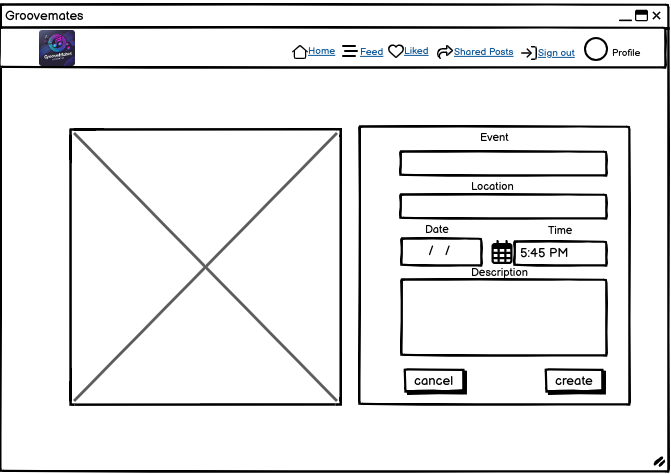
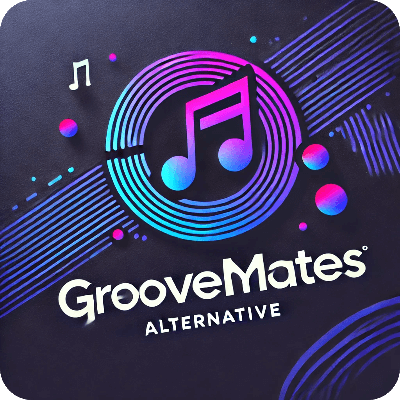

# Groovemates

**Advanced Front-End Portfolio Project(PP5) - Code Institute**

View the deployed site [here.](https://groovemates-frontend-b3335269700f.herokuapp.com/) 

The goal of this project is to build an engaging online platform where music enthusiasts can connect, share musical events and in that way helps in discovering different types of musics. I personally believe music can heal anything in this world.

The Groovemates frontend is the user interface component of the Groovemates application, designed with React to provide an engaging and intuitive experience for users interacting with the social network. It connects with the [Groovemates Backend API](https://groovemates-backend-b16861eb6026.herokuapp.com/), enhancing user experience by offering a responsive and dynamic interface.

 

## Table of contents

- [User Experience](#user-experience)
  - [Epics and User stories](#epics-and-user-stories)
- [Design](#design)
  - [Wireframes](#wireframes)
  - [Logo](#logo)
  - [Favicon](#favicon)
  - [Typography](#typography)
- [Structure](#structure)
- [Features](#features)
- [Reusable Components](#reusable-components)
- [Bugs](#bugs)
- [Technologies Used](#technologies-used)
  - [Languages](#languages)
  - [Tools](#tools)
  - [Frameworks](#frameworks)
  - [Libraries and modules](#libraries-and-modules)
- [Testing](#testing)
  - [Validator Testing](#validator-testing)
  - [Lighthouse Test](#lighthouse-test)
  - [Manual testing](#manual-testing)
  - [Browser Compatibility](#browser-compatibility)
  - [Automated Testing](#automated-testing)
- [Deployment](#deployment)
  - [Heroku](#heroku)
  - [Local deployment](#local-deployment)
  - [Forking this GitHub repository](#forking-this-github-repository)
  - [Clone this repository](#clone-this-repository)
- [Credits](#credits)
  - [Content](#content)
  - [Code](#code)
  - [ReadMe](#readme)
  - [Acknowledgments](#acknowledgments)

## User Experience

I used an Agile methodology approach to plan this project. This was implemented through the GitHub Project board with milestones, epics, user stories and tasks. Given the limited time frame, I've prioritized creating a broad overview of the project's features through high-level user stories, epics, and milestones. In a collaborative environment, I would delve into more granular user stories to ensure a comprehensive understanding of the requirements.
Each user story was classified with a label according to MoSCoW prioritization. 
The Kanban board can be seen [here](https://github.com/users/Pramilashanmugam/projects/7).

### Epics and User stories

*Groovemates* is designed for active individuals who love to connect and explore music. The platform offers the users to upload music events across and helps other user to get to know the information and likewise share with others. While it’s open to everyone, the primary focus is on those who loves music, socializing, and want to explore different joners of music. Groovemates helps users connect with like-minded people and enrich their social life. 

List of Epics:  

The project was divided into nine Epics, each containing the corresponding user stories: 
- Epic 1: Navigation and authentication
- Epic 2: Adding and liking Posts
- Epic 3: The Posts Page
- Epic 4: The Post Page
- Epic 5: The Profile Page
- Epic 6: Reporting a Post
- Epic 7: Reporting a Comment
- Epic 8: Share a Post
- Epic 9: Followers and following

User Stories with their id:   

- As a user I can view a navbar from every page so that I can navigate easily between pages. [#1](https://github.com/Pramilashanmugam/groovemates_frontend/issues/1)
- As a user I can navigate through pages quickly so that I can view content seamlessly without page refresh [#2](https://github.com/Pramilashanmugam/groovemates_frontend/issues/2)
- As a user I can create a new account so that I can access all the features for signed up users [#3](https://github.com/Pramilashanmugam/groovemates_frontend/issues/3)
- As a user I can sign in to the app so that I can access functionality for logged in users [#4](https://github.com/Pramilashanmugam/groovemates_frontend/issues/4)
- As a user I can tell if I am logged in or not so that I can log in if I need to [#5](https://github.com/Pramilashanmugam/groovemates_frontend/issues/5)
- As a user I can maintain my logged-in status until I choose to log out so that my user experience is not compromised [#6](https://github.com/Pramilashanmugam/groovemates_frontend/issues/6)
- As a logged out user I can see sign in and sign up options so that I can sign in/sign up [#7](https://github.com/Pramilashanmugam/groovemates_frontend/issues/7)
- As a user I can view user's avatars so that I can easily identify users of the application [#8](https://github.com/Pramilashanmugam/groovemates_frontend/issues/8)
- As a logged in user I can create posts so that I can share my a music event with the world! [#9](https://github.com/Pramilashanmugam/groovemates_frontend/issues/9)
- As a user I can view the details of a single post so that I can learn more about it [#10](https://github.com/Pramilashanmugam/groovemates_frontend/issues/10)
- As a logged in user I can like a post so that I can show my support for the posts that interest me [#11](https://github.com/Pramilashanmugam/groovemates_frontend/issues/11)
- As a user I can view all the most recent posts, ordered by most recently created first so that I am up to date with the newest content [#12](https://github.com/Pramilashanmugam/groovemates_frontend/issues/12)
- As a user, I can search for posts with keywords, so that I can find the posts and user profiles I am most interested in. [#13](https://github.com/Pramilashanmugam/groovemates_frontend/issues/13)
- As a logged in user I can view the posts I liked so that I can find the posts I enjoy the most [#14](https://github.com/Pramilashanmugam/groovemates_frontend/issues/14)
- As a logged in user I can view content filtered by users I follow so that I can keep up to date with what they are posting about [#15](https://github.com/Pramilashanmugam/groovemates_frontend/issues/15)
- As a user I can keep scrolling through the images on the site, that are loaded for me automatically so that I don't have to click on "next page" etc [#16](https://github.com/Pramilashanmugam/groovemates_frontend/issues/16)
- As a user I can view the posts page so that I can read the comments about the post [#17](https://github.com/Pramilashanmugam/groovemates_frontend/issues/17)
- As a post owner I can edit my post title and description so that I can make corrections or update my post after it was created [#18](https://github.com/Pramilashanmugam/groovemates_frontend/issues/18)
- As a logged in user I can add comments to a post so that I can share my thoughts about the post [#19](https://github.com/Pramilashanmugam/groovemates_frontend/issues/19)
- As a user I can see how long ago a comment was made so that I know how old a comment is [#20](https://github.com/Pramilashanmugam/groovemates_frontend/issues/20)
- As a user I can read comments on posts so that I can read what other users think about the posts [#21](https://github.com/Pramilashanmugam/groovemates_frontend/issues/21)
- As an owner of a comment I can delete my comment so that I can control removal of my comment from the application [#22](https://github.com/Pramilashanmugam/groovemates_frontend/issues/22)
- As an owner of a comment I can edit my comment so that I can fix or update my existing comment [#23](https://github.com/Pramilashanmugam/groovemates_frontend/issues/23)
- As a user I can view other users profiles so that I can see their posts and get benefited by knowing the concerts happening [#24](https://github.com/Pramilashanmugam/groovemates_frontend/issues/24)
- As a user I can view statistics about a specific user: bio, number of posts, follows and users followed so that I can learn more about them [#26](https://github.com/Pramilashanmugam/groovemates_frontend/issues/26)
- As a user I can view all the posts by a specific user so that I can catch up on their latest posts, or decide I want to follow them [#28](https://github.com/Pramilashanmugam/groovemates_frontend/issues/28)
- As a logged in user I can edit my profile so that I can change my profile picture and bio [#29](https://github.com/Pramilashanmugam/groovemates_frontend/issues/29)
- As a logged in user I can update my username and password so that I can change my display name and keep my profile secure [#30](https://github.com/Pramilashanmugam/groovemates_frontend/issues/30)
- As a logged-in user, I can report a post so that I can bring attention to inappropriate or harmful content. [#31](https://github.com/Pramilashanmugam/groovemates_frontend/issues/31)
- As an admin, I can take action on a reported post (delete/ warn user, etc.) so that I can maintain a safe and respectful environment. [#32](https://github.com/Pramilashanmugam/groovemates_frontend/issues/32)
- As a logged-in user, I can report a comment so that I can alert the moderation team about potentially inappropriate interactions. [#33](https://github.com/Pramilashanmugam/groovemates_frontend/issues/33)
- As an admin, I can view reported comments and their details to assess whether they violate community guidelines and can take action on a reported comment (delete, warn user, etc.) [#34](https://github.com/Pramilashanmugam/groovemates_frontend/issues/34)
- As a logged-in user, I can share another user’s post to my own wall and also in a sharedpost page so that I can share content I find interesting with others. [#35](https://github.com/Pramilashanmugam/groovemates_frontend/issues/35)
- As a user, I want to have a dropdown to edit or delete my post so that I can use CRUD functionality on my Post. [#36](https://github.com/Pramilashanmugam/groovemates_frontend/issues/36)
- As a user, I can see a list of the most followed profiles so that I can see which profiles are popular. [#37](https://github.com/Pramilashanmugam/groovemates_frontend/issues/37)

## Design

### Wireframes

Due to lack of time, some of the originally planned features that can be seen on the wireframe had to be deleted or implemented differently.

 Home page 

 
Wireframe for home page for logged-out user:  

 
 
Wireframes for home page for logged-in user:  
 
 

 Sign up & Sign In 

 
User authentication was implemented using dj-rest-auth. This library provides a comprehensive set of features for user management, including registration, login, and logout functionalities.
For the final design of the authentication views, I utilized the Code Institute moments walkthrough design, which closely aligns with the wireframes originally created for the project. This approach ensured a consistent user experience throughout the application. 

 
 
 
 

 Create a Post 

 
To create a Post, a form was designed that closely resembles the one outlined in the wireframes. This form includes fields for all necessary information, ensuring a seamless user experience that aligns with the original design specifications. 

 
 

 Profile Page 

 

 
 

### Imagery
 
The cat listening to music, which can be seen in the placeholder images in create a post, was found at Pexel.

 

#### Logo

The logo for "GrooveMates" has a modern and vibrant design, emphasizing a music-themed aesthetic. Here are its key features:

Color Scheme: It features a gradient of neon colors, predominantly pinks, purples, and blues, set against a dark background. This gives it a futuristic and energetic vibe.

Central Icon: A music note is at the heart of the design, symbolizing music and rhythm, enclosed within concentric circular lines that resemble sound waves or records.

Typography: The name "GrooveMates" is written in bold, modern font with "Alternative" in a smaller, more understated style. The font choice complements the music theme with a sleek and contemporary look.

Visual Effects: The logo incorporates dynamic elements like dots and lines, adding movement and vibrancy, suggestive of sound or pulsating beats.

Overall Design: The circular layout emphasizes inclusivity and community, aligning with the concept of connecting people through music.

It's a visually engaging design that perfectly captures the essence of a music-focused, modern brand.

 

#### Favicon

The favicon was created with [Favicon.io](https://favicon.io/favicon-generator/) by using the logos color theme and music note. 

 

#### Colour Scheme:

The color palette was created based on the neon colors of the logo text with [ColorSpace](https://mycolor.space/?hex=%23FF3131&sub=1). The navbar has the gradient pastel colours.

 Click here to see the colour palette 

 

I created this colour palette with [coloors](https://coolors.co/). 
 

### Typography

I have used "DM Sans", sans-serif font through out the project.

## Structure

All information about the structure can be found in the README of the API [here](https://github.com/Pramilashanmugam/GrooveMates_backend)

## Features

### Existing Features

To learn more about each feature, please click on the respective headline

 Header with logo and navbar 

 

To ensure uniformity and a sense of familiarity for users, all pages include the same header with navigation links depending on the authentication status of the user. 
The header consists of the logo, which is always arranged on the left and acts as a link to return to the main page. On the right side is the navigation bar, which turns into a clickable burger menu on smaller screens. Depending on whether the user is logged in or not, the navigation elements adapt accordingly. 
 

**For Logged-Out Users:** 
- *Home*: Redirects to the home page, displaying an overview of all active Groovemates posts from latest to old.  
- *Sign Up*: Takes the user to the registration page to create an account and begin interacting with the site.  
- *Log In*: Directs to the login page for returning users to access their accounts. 

**For Logged-In Users:**  
- *Home*: Same as the logged-out view, showing all active Posts.
- *Addpost*: Directs to the page where the user can create a new Post.
participating in.
- *Feed*: Shows all posts of users who has been followed by the currentuser.
- *Liked*: Displays all the posts which was liked by the user.
- *Shared Posts*: It has all the posts which was shared by all other users.
- *Avatar/Profile*: It displays the number of followers, following, number of post uploaded by currentuser, on sidebar can view the shared post of only the current user.
- *Sign Out*: Allows the user to securely log out of their account.

 

View for users who are not logged in: 
  - Screenshot of header in mobile view: 
   
  - Screenshot of header in mobile view with toggled navigation: 
   
  - Screenshot of header on larger screens: 
   

  View for users who are logged in: 
  - Screenshot of header in mobile view: 
   
  - Screenshot of header in mobile view with toggled navigation: 
   
  - Screenshot of header in desktop view: 
   
 

 Favicon & Title

 

To create a consistent appearance, the logo, which appears in a square form with edges rounded in the navigation bar, was adapted into a background transparent version to create the favicon. 
Screenshot of the favicon: 
 

 User authentication 

 

The user authentication system is implemented using the [dj-rest-auth](https://dj-rest-auth.readthedocs.io/en/latest/) framework, ensuring secure and reliable access to the site. This feature includes standard registration, login, and logout processes, with error handling and feedback tailored to match the application's design.  

**Sign Up** 
Users who are new to the site or have not yet created an account, can select the "Sign up" option from the Navigation Bar to register for a new user account. This process utilizes the standard dj-rest/auth/registration method for user account creation. After properly registering, the user will be redirected to the login page and a success message will be displayed for two seconds. 
Screenshot for Sign Up:  
 
Screenshot for Sign Up with Error message for username:  
 
Screenshot for Sign Up with Error message for password:  
 

**Sign in**  
Users who already have an account can click on the "Signin" option in the Navigation Bar to access their account. This page utilizes the standard dj-rest/auth/login method for user authentication. After the user correctly logs in, the user is redirected to the homepage, where an overview of all created Posts is shown. 
Screenshot for Log In:  
 
Screenshot for Log In with error message:  
 

**Sign Out** 
To Sign out, the user simply needs to click on the "Sign Out" option in the menu. Upon doing so, the user is successfully logged out via the /dj-rest-auth/logout/ endpoint, is redirected to the log-in page. 
Screenshot after signed out  
 

