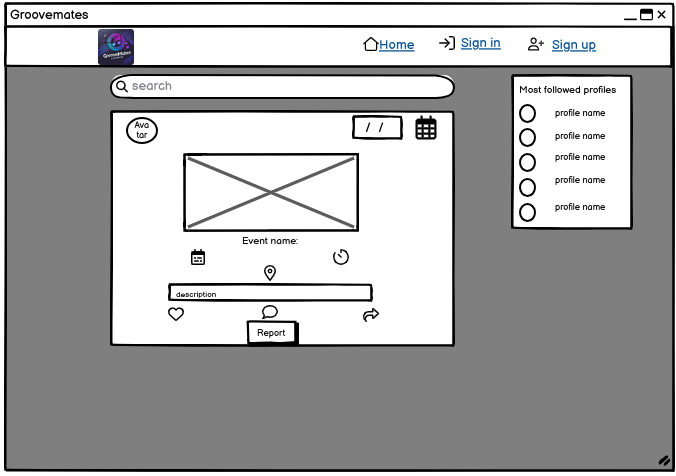
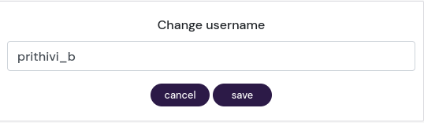
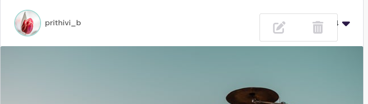

# Groovemates

**Advanced Front-End Portfolio Project(PP5) - Code Institute**

View the deployed site [here.](https://groovemates-frontend-b3335269700f.herokuapp.com/) 

The goal of this project is to build an engaging online platform where music enthusiasts can connect, share musical events and in that way helps in discovering different types of musics. I personally believe music can heal anything in this world.

The Groovemates frontend is the user interface component of the Groovemates application, designed with React to provide an engaging and intuitive experience for users interacting with the social network. It connects with the [Groovemates Backend API](https://groovemates-backend-b16861eb6026.herokuapp.com/), enhancing user experience by offering a responsive and dynamic interface.

 

## Table of contents

- [User Experience](#user-experience)
  - [Epics and User stories](#epics-and-user-stories)
- [Design](#design)
  - [Wireframes](#wireframes)
  - [Logo](#logo)
  - [Favicon](#favicon)
  - [Typography](#typography)
- [Structure](#structure)
- [Features](#features)
- [Reusable Components](#reusable-components)
- [Bugs](#bugs)
- [Technologies Used](#technologies-used)
  - [Languages](#languages)
  - [Tools](#tools)
  - [Frameworks](#frameworks)
  - [Libraries and modules](#libraries-and-modules)
- [Testing](#testing)
  - [Validator Testing](#validator-testing)
  - [Lighthouse Test](#lighthouse-test)
  - [Manual testing](#manual-testing)
  - [Browser Compatibility](#browser-compatibility)
  - [Automated Testing](#automated-testing)
- [Deployment](#deployment)
  - [Heroku](#heroku)
  - [Local deployment](#local-deployment)
  - [Forking this GitHub repository](#forking-this-github-repository)
  - [Clone this repository](#clone-this-repository)
- [Credits](#credits)
  - [Content](#content)
  - [Code](#code)
  - [ReadMe](#readme)
  - [Acknowledgments](#acknowledgments)

## User Experience

I used an Agile methodology approach to plan this project. This was implemented through the GitHub Project board with milestones, epics, user stories and tasks. Given the limited time frame, I've prioritized creating a broad overview of the project's features through high-level user stories, epics, and milestones. In a collaborative environment, I would delve into more granular user stories to ensure a comprehensive understanding of the requirements.
Each user story was classified with a label according to MoSCoW prioritization. 
The Kanban board can be seen [here](https://github.com/users/Pramilashanmugam/projects/7).

### Epics and User stories

*Groovemates* is designed for active individuals who love to connect and explore music. The platform offers the users to upload music events across and helps other user to get to know the information and likewise share with others. While it’s open to everyone, the primary focus is on those who loves music, socializing, and want to explore different joners of music. Groovemates helps users connect with like-minded people and enrich their social life. 

List of Epics:  

The project was divided into nine Epics, each containing the corresponding user stories: 
- Epic 1: Navigation and authentication
- Epic 2: Adding and liking Posts
- Epic 3: The Posts Page
- Epic 4: The Post Page
- Epic 5: The Profile Page
- Epic 6: Reporting a Post
- Epic 7: Reporting a Comment
- Epic 8: Share a Post
- Epic 9: Followers and following

User Stories with their id:   

- As a user I can view a navbar from every page so that I can navigate easily between pages. [#1](https://github.com/Pramilashanmugam/groovemates_frontend/issues/1)
- As a user I can navigate through pages quickly so that I can view content seamlessly without page refresh [#2](https://github.com/Pramilashanmugam/groovemates_frontend/issues/2)
- As a user I can create a new account so that I can access all the features for signed up users [#3](https://github.com/Pramilashanmugam/groovemates_frontend/issues/3)
- As a user I can sign in to the app so that I can access functionality for logged in users [#4](https://github.com/Pramilashanmugam/groovemates_frontend/issues/4)
- As a user I can tell if I am logged in or not so that I can log in if I need to [#5](https://github.com/Pramilashanmugam/groovemates_frontend/issues/5)
- As a user I can maintain my logged-in status until I choose to log out so that my user experience is not compromised [#6](https://github.com/Pramilashanmugam/groovemates_frontend/issues/6)
- As a logged out user I can see sign in and sign up options so that I can sign in/sign up [#7](https://github.com/Pramilashanmugam/groovemates_frontend/issues/7)
- As a user I can view user's avatars so that I can easily identify users of the application [#8](https://github.com/Pramilashanmugam/groovemates_frontend/issues/8)
- As a logged in user I can create posts so that I can share my a music event with the world! [#9](https://github.com/Pramilashanmugam/groovemates_frontend/issues/9)
- As a user I can view the details of a single post so that I can learn more about it [#10](https://github.com/Pramilashanmugam/groovemates_frontend/issues/10)
- As a logged in user I can like a post so that I can show my support for the posts that interest me [#11](https://github.com/Pramilashanmugam/groovemates_frontend/issues/11)
- As a user I can view all the most recent posts, ordered by most recently created first so that I am up to date with the newest content [#12](https://github.com/Pramilashanmugam/groovemates_frontend/issues/12)
- As a user, I can search for posts with keywords, so that I can find the posts and user profiles I am most interested in. [#13](https://github.com/Pramilashanmugam/groovemates_frontend/issues/13)
- As a logged in user I can view the posts I liked so that I can find the posts I enjoy the most [#14](https://github.com/Pramilashanmugam/groovemates_frontend/issues/14)
- As a logged in user I can view content filtered by users I follow so that I can keep up to date with what they are posting about [#15](https://github.com/Pramilashanmugam/groovemates_frontend/issues/15)
- As a user I can keep scrolling through the images on the site, that are loaded for me automatically so that I don't have to click on "next page" etc [#16](https://github.com/Pramilashanmugam/groovemates_frontend/issues/16)
- As a user I can view the posts page so that I can read the comments about the post [#17](https://github.com/Pramilashanmugam/groovemates_frontend/issues/17)
- As a post owner I can edit my post title and description so that I can make corrections or update my post after it was created [#18](https://github.com/Pramilashanmugam/groovemates_frontend/issues/18)
- As a logged in user I can add comments to a post so that I can share my thoughts about the post [#19](https://github.com/Pramilashanmugam/groovemates_frontend/issues/19)
- As a user I can see how long ago a comment was made so that I know how old a comment is [#20](https://github.com/Pramilashanmugam/groovemates_frontend/issues/20)
- As a user I can read comments on posts so that I can read what other users think about the posts [#21](https://github.com/Pramilashanmugam/groovemates_frontend/issues/21)
- As an owner of a comment I can delete my comment so that I can control removal of my comment from the application [#22](https://github.com/Pramilashanmugam/groovemates_frontend/issues/22)
- As an owner of a comment I can edit my comment so that I can fix or update my existing comment [#23](https://github.com/Pramilashanmugam/groovemates_frontend/issues/23)
- As a user I can view other users profiles so that I can see their posts and get benefited by knowing the concerts happening [#24](https://github.com/Pramilashanmugam/groovemates_frontend/issues/24)
- As a user I can view statistics about a specific user: bio, number of posts, follows and users followed so that I can learn more about them [#26](https://github.com/Pramilashanmugam/groovemates_frontend/issues/26)
- As a user I can view all the posts by a specific user so that I can catch up on their latest posts, or decide I want to follow them [#28](https://github.com/Pramilashanmugam/groovemates_frontend/issues/28)
- As a logged in user I can edit my profile so that I can change my profile picture and bio [#29](https://github.com/Pramilashanmugam/groovemates_frontend/issues/29)
- As a logged in user I can update my username and password so that I can change my display name and keep my profile secure [#30](https://github.com/Pramilashanmugam/groovemates_frontend/issues/30)
- As a logged-in user, I can report a post so that I can bring attention to inappropriate or harmful content. [#31](https://github.com/Pramilashanmugam/groovemates_frontend/issues/31)
- As an admin, I can take action on a reported post (delete/ warn user, etc.) so that I can maintain a safe and respectful environment. [#32](https://github.com/Pramilashanmugam/groovemates_frontend/issues/32)
- As a logged-in user, I can report a comment so that I can alert the moderation team about potentially inappropriate interactions. [#33](https://github.com/Pramilashanmugam/groovemates_frontend/issues/33)
- As an admin, I can view reported comments and their details to assess whether they violate community guidelines and can take action on a reported comment (delete, warn user, etc.) [#34](https://github.com/Pramilashanmugam/groovemates_frontend/issues/34)
- As a logged-in user, I can share another user’s post to my own wall and also in a sharedpost page so that I can share content I find interesting with others. [#35](https://github.com/Pramilashanmugam/groovemates_frontend/issues/35)
- As a user, I want to have a dropdown to edit or delete my post so that I can use CRUD functionality on my Post. [#36](https://github.com/Pramilashanmugam/groovemates_frontend/issues/36)
- As a user, I can see a list of the most followed profiles so that I can see which profiles are popular. [#37](https://github.com/Pramilashanmugam/groovemates_frontend/issues/37)

## Design

### Wireframes

Due to lack of time, some of the originally planned features that can be seen on the wireframe had to be deleted or implemented differently.

 Home page 

 
Wireframe for home page for logged-out user:  

 
 
Wireframes for home page for logged-in user:  
 
 

 Sign up & Sign In 

 
User authentication was implemented using dj-rest-auth. This library provides a comprehensive set of features for user management, including registration, login, and logout functionalities.
For the final design of the authentication views, I utilized the Code Institute moments walkthrough design, which closely aligns with the wireframes originally created for the project. This approach ensured a consistent user experience throughout the application. 

 
 
 
 

 Create a Post 

 
To create a Post, a form was designed that closely resembles the one outlined in the wireframes. This form includes fields for all necessary information, ensuring a seamless user experience that aligns with the original design specifications. 

 
 

 Profile Page 

 

 
 

### Imagery
 
The cat listening to music, which can be seen in the placeholder images in create a post, was found at Pexel.

 

#### Logo

The logo for "GrooveMates" has a modern and vibrant design, emphasizing a music-themed aesthetic. Here are its key features:

Color Scheme: It features a gradient of neon colors, predominantly pinks, purples, and blues, set against a dark background. This gives it a futuristic and energetic vibe.

Central Icon: A music note is at the heart of the design, symbolizing music and rhythm, enclosed within concentric circular lines that resemble sound waves or records.

Typography: The name "GrooveMates" is written in bold, modern font with "Alternative" in a smaller, more understated style. The font choice complements the music theme with a sleek and contemporary look.

Visual Effects: The logo incorporates dynamic elements like dots and lines, adding movement and vibrancy, suggestive of sound or pulsating beats.

Overall Design: The circular layout emphasizes inclusivity and community, aligning with the concept of connecting people through music.

It's a visually engaging design that perfectly captures the essence of a music-focused, modern brand.

 

#### Favicon

The favicon was created with [Favicon.io](https://favicon.io/favicon-generator/) by using the logos color theme and music note. 

 

#### Colour Scheme:

The color palette was created based on the neon colors of the logo text with [ColorSpace](https://mycolor.space/?hex=%23FF3131&sub=1). The navbar has the gradient pastel colours.

 Click here to see the colour palette 

 

I created this colour palette with [coloors](https://coolors.co/). 
 

### Typography

I have used "DM Sans", sans-serif font through out the project.

## Structure

All information about the structure can be found in the README of the API [here](https://github.com/Pramilashanmugam/GrooveMates_backend)

## Features

### Existing Features

To learn more about each feature, please click on the respective headline

 Header with logo and navbar 

 

To ensure uniformity and a sense of familiarity for users, all pages include the same header with navigation links depending on the authentication status of the user. 
The header consists of the logo, which is always arranged on the left and acts as a link to return to the main page. On the right side is the navigation bar, which turns into a clickable burger menu on smaller screens. Depending on whether the user is logged in or not, the navigation elements adapt accordingly. 
 

**For Logged-Out Users:** 
- *Home*: Redirects to the home page, displaying an overview of all active Groovemates posts from latest to old.  
- *Sign Up*: Takes the user to the registration page to create an account and begin interacting with the site.  
- *Log In*: Directs to the login page for returning users to access their accounts. 

**For Logged-In Users:**  
- *Home*: Same as the logged-out view, showing all active Posts.
- *Addpost*: Directs to the page where the user can create a new Post.
- *Feed*: Shows all posts of users who has been followed by the currentuser.
- *Liked*: Displays all the posts which was liked by the user.
- *Shared Posts*: It has all the posts which was shared by all other users.
- *Avatar/Profile*: It displays the number of followers, following, number of post uploaded by currentuser, on sidebar can view the shared post of only the current user.
- *Sign Out*: Allows the user to securely log out of their account.

 

View for users who are not logged in: 
  - Screenshot of header in mobile view: 
   
  - Screenshot of header in mobile view with toggled navigation: 
   
  - Screenshot of header on larger screens: 
   

  View for users who are logged in: 
  - Screenshot of header in mobile view: 
   
  - Screenshot of header in mobile view with toggled navigation: 
   
  - Screenshot of header in desktop view: 
   
 

 Favicon & Title

 

To create a consistent appearance, the logo, which appears in a square form with edges rounded in the navigation bar, was adapted into a background transparent version to create the favicon. 
Screenshot of the favicon: 
 

 User authentication 

 

The user authentication system is implemented using the [dj-rest-auth](https://dj-rest-auth.readthedocs.io/en/latest/) framework, ensuring secure and reliable access to the site. This feature includes standard registration, login, and logout processes, with error handling and feedback tailored to match the application's design.  

**Sign Up** 
Users who are new to the site or have not yet created an account, can select the "Sign up" option from the Navigation Bar to register for a new user account. This process utilizes the standard dj-rest/auth/registration method for user account creation. After properly registering, the user will be redirected to the login page and a success message will be displayed for two seconds. 
Screenshot for Sign Up:  
 
Screenshot for Sign Up with Error message for username:  
 
Screenshot for Sign Up with Error message for password:  
 

**Sign in**  
Users who already have an account can click on the "Signin" option in the Navigation Bar to access their account. This page utilizes the standard dj-rest/auth/login method for user authentication. After the user correctly logs in, the user is redirected to the homepage, where an overview of all created Posts is shown. 
Screenshot for Log In:  
 
Screenshot for Log In with error message:  
 

**Sign Out** 
To Sign out, the user simply needs to click on the "Sign Out" option in the menu. Upon doing so, the user is successfully logged out via the /dj-rest-auth/logout/ endpoint, is redirected to the log-in page. 
Screenshot after signed out  
 

 

 User Profile 

 

The user can access their profile only if logged-in through the navigation bar, from the "Most Popular Profiles" section (if they are listed there), or can say by clicking on the profile picture it will take you to profile page.  

The profile contains the following components: 
**Profile Picture**: If the user hasn’t uploaded a picture, a placeholder image of default avatar icon will appear throughout the site is shown. 
**Username**: The username that the user created during the signup process. 
**Follow/Unfollow button**: This button appears only if the user being viewed is not the currently logged-in user. 
**Overview of Posts**: Displays the number of Posts the user has currently created. 
**Followers and Following Counts**: Shows how many people are following the user and how many people the user is following. 
**"Bio" Description**: A personal description if the user has filled it out. 
**My Shared Posts**: A section on the sidebar where the user's Shared post will be displayed below the most followed profile. 

When a user creates a Post, the Post count on their profile increases. If the user follows or unfollows another user, the followers count on their profile will increase or decrease accordingly. Similarly, if another user follows or unfollows them, the following count will be updated. Additionally, the follow/unfollow button will change to reflect the current following status.
Below these components, there is an overview of all the Posts the user currently has online.If the user has created more than 10 Posts, additional Posts will continue to load as the user scrolls down (infinite scroll functionality). During this process, a spinner is briefly displayed to indicate that more content is being loaded. 
When a user visits their own profile, dropdown point towards left in grey appear on the right side. Clicking on these dropdown reveals a menu where the user can edit their profile, username, or password. Each option redirects the user to the corresponding form page for making the desired changes.  
When editing their profile, the user must ensure that the profile picture does not exceed 2 MB in size.
 

Screenshot of profile page(desktop view) after signing up: 
 
Screenshot of profile page(mobile): 
 
Screenshot of profile page(desktop): 
 

**Edit a profile** 
Screenshot of profile edit button: 
 
Screenshot of profile page with edit menu(desktop): 
 
Screenshot of profile page with edit menu(mobile): 
 
Screenshot of edited username page: 
 
Screenshot of error during editing username page:
 

**Edit username**  
Screenshot of edit password page: 
 

**Edit password** 
Screenshot of edit password page: 
 

 Post Management

 
Post Management includes the following topics: 

**Adding a new Post**: Users can create and submit new Posts through a designated form.
**Post Detail View**: Users can view detailed information about a specific Post by clicking on the title or the image in the Post card. 
**Editing or deleting an existing Post**: Users can modify or remove their existing Posts through an edit or delete option. 
**Overview of all existing Posts on Homepage**: The home page displays a comprehensive list of all available Posts. 
**Overview of Posts created by the user on their profile page**: Users can view a summary of all Posts they have created from their profile page. 
**Overview of liked Posts**: Users can access a list of Posts they have liked for quick reference. 
**Overview of Posts whom user following in Feed**: Users can view a list of Posts of the user who are being followed.   
**Overview of Posts on Shared posts**: Users can view a list of all shared Posts of all the users with the name of people who all have shared the post.  

 - **Adding a new Post** 
To add a Post, the user must sign up and log in. They can then navigate to the appropriate page via the navigation bar. All form fields are required except for the description. The date must be today or in the future. The user can upload an image for the Post. If no image is uploaded, a placeholder image will be shown instead.
If a required field is not filled out, an error message will be shown indicating which fields need to be completed. 
After the user clicks the 'Create' button and all required fields are correctly filled, they will be redirected to the detail page of this Post.  

Screenshot of 'add a Post' page: 
 
Screenshot of error message for image larger than 2 MB: 
 
Screenshot of error message for date validation: 
 
 

- **Post detail view** 
A Post contains several elements in its detailed view. The following elements are included for the owner of the Post: 
  - *Event*: The title of the event.  
  - *Image*: The image associated with the Post or the placeholder image  
  - *Description*: A brief description of the Post, if given by the user.  
  - *Date, Time, and Location*: Details about when and where the Post will take place. 
  - *Last Updated*: Information on when the Post was last updated.  
Below these elements, there are three icons in a row with numbers next to each for counting:  
  - *Heart Icon*: Displays the number of likes. If the currently logged-in user has liked the Post, the heart will be filled with red. 
  - *Comment Icon*: Shows the number of comments associated with the Post. 
  - *share Icon*: Displays the number of shares. If the currently logged-in user click the share the icon will turn to blue. 
  - *Report button*: logged in user can report a post incase of spam, irrelevant. Submitted reports will be accessed only by admin.
Underneath these icons is the comments section. 

Screenshot of Post detail page for owner of the Post in mobile view, dropdown for edit appears: 
 
Screenshot of Post detail page for other users of the Post in mobile view, dropdown for edit disppears: 
 
Screenshot of Post detail page for owner of the Post in desktop view, dropdown for edit appears: 
 
Screenshot of Post detail for others of the Post in desktop view, dropdown for edit disappears: 
 
Screenshot of edit option for a post.
 
 

- **Edit a Post** 
As part of the full CRUD functionality, the Post owner has the ability to edit the Post. When a user clicks the link to edit their Post, they are redirected to a form page where the existing data is already populated in the corresponding fields. The form retains the same validations as the "Create a Post" form, including image size limits (maximum 2 MB), required fields, and date validation (the date must be today or in the future). After the user clicks the "save" button, they are redirected to the Post's detail page where you can see the update post. 

Screenshot of post before edit 
 
Screenshot of post after edit: 
 
Screenshot of validation message during edit: 
 

- **Delete a Post** 
As part of the full CRUD functionality, the Post owner can delete a Post. This can be achieved from the Post overview by clicking on the dropdown icon as well as from the detail page of the Post. After successful deletion, the user is redirected back to the homepage and the corresponding Post is deleted from the database and the overview. 

Screenshot of delete icon on post 
 

- **Displaying an overview of all existing Posts on the Homepage.** 
The user can access the overview page of all Posts that have been created by clicking on the homepage. The user can access the overview page displaying all created Posts by clicking on the "Home" link in the navigation bar or by clicking on the logo. This page presents Posts sorted by the date they were added, with the most recent ones appearing first. Each Post is displayed in a card format that includes essential details such as the Event, description, date, time, location and counts of likes, shares, comments and report. Additionally, the last updated timestamp is shown. The overview page features infinite scroll functionality: when the user scrolls through 10 Posts, the next set of Posts is automatically loaded. During this process, a spinner is briefly displayed to indicate that more content is being loaded. 
In mobile view, the most active profiles are displayed above the Posts, while in desktop view, they are displayed alongside the Posts.
  

link for Post overview page  
[Click here to view Post Overview.](https://groovemates-frontend-b3335269700f.herokuapp.com/) 

- **Displaying an overview of liked Posts** 
When a user likes a Post by clicking on the heart icon within the Post card, they can later access an overview page of all their liked Posts. This page can be reached through the navigation bar by clicking on *liked*. The liked Posts are displayed similarly to those on the homepage overview, with each Post presented in a card format. This includes the event, description, date, time, location and counts of likes, shares, comments and report. The page also features infinite scroll functionality, where additional Posts are loaded after scrolling through the first 10 entries, with a brief display of a spinner indicating the loading process. In mobile view, the most active profiles are displayed above the Posts, while in desktop view, they are displayed alongside the Posts.  

- **Displaying an overview of Shared Posts** 
When a user clicks the share icon the share counts increases by one and the post will get posted on the Shared Post link which can be reached on the navigation bar. Users a restricted to share a Post only once, if they attempt to share more than once a message will displayed you cannot share more than once. The Shared Posts are displayed similarly to those on the homepage overview, with each Post presented in a card format. This includes the event, description, date, time, location and counts of shares, likes, comments and report, additionally it also show the list of user's name who have shared the post on top of the post. The page also features infinite scroll functionality, where additional Posts are loaded after scrolling through the first 10 entries, with a brief display of a spinner indicating the loading process. In mobile view, the most active profiles are displayed above the Posts, while in desktop view, they are displayed alongside the Posts.

- **Displaying an Overview of Posts from followed Users**  
As a user, you can view an overview of all Posts created by the users you follow. This page can be reached through the navigation bar by clicking the link  *Feed* in the Navbar. This page showcases Posts created by the followed users, presented in a card format similar to the homepage overview. Each card includes essential details such as the event, description, date, time, location and counts of shares, likes, comments and report.
The page supports infinite scroll functionality: after scrolling through the initial set of entries, more Posts will be loaded automatically, accompanied by a spinner indicating the loading process. On mobile devices, the Posts are displayed with the most active profiles shown prominently above them, while on desktop, these profiles are displayed alongside the Posts.

- **Displaying an overview of all Posts created by user** 
As already explained in the profile feature, all Posts created by the user are listed on their profile.

 User Interaction 

 
Users can interact with each other in the following ways:
- Commenting on a Post by going to the detailed view of the Post, which can also be accessed by clicking on the comment icon.
- Sharing the post shows the interest on the event and also helping in spreading the word.
- liking a Post by clicking on the heart icon.
- Follow/Unfollow functionality by clicking on the Follow/Unfollow button, which is available in the "Most followed profiles" section, the shared posts, and the profile overview. This option is only available when the logged-in user is not viewing their own profile.  
 

**share and like Icons**:  
The icons representing share (sharing arrow icon) and likes (heart icon) dynamically change based on the user's status: 
- *share*: When the user clicks on the share icon, it toggles their share status. If the user is has shared a post, the icon will change to blue colour and the share count gets increased accordingly. Users are restricted to share a Post only once. 
- *likes*: When the user clicks on the heart icon, it toggles the like status of the Post. If the user has likeed the Post, the heart icon will turn red, and the like count will increase accordingly. 

**Report Button:**
The Report button is for the user to inform the admin about a post if it is not relevant to the website goal. On clicking the button, a form containing the reasons for the report and description is available. User can choose the reason from dropdown and share their reasons in description and then submit. On Submit, user gets a confirmation that the report will be reviewed by admin.

Screenshot of Report button on post for logged in user 
 
Screenshot of Report button on post for logged out user 
 
Screenshot of Report Form 
 
Screenshot of Report Reasons dropdown 
 
Screenshot of Report confirmation message on submit 
 

**Comment Section:**
Users can interact with the Post by adding comments:  

The user's profile image is displayed next to the comment form field. After entering a comment and clicking the "post" button, the comment is displayed under the Post in a list format. Each comment includes the commenter's profile image, the time when the comment was added, and the comment content.
If the currently logged-in user is the owner of the comment, dropdown icon appear next to the comment, providing options to edit or delete the comment.  
- *Edit*: When the user clicks "Edit" on their comment, the comment form reopens with the existing content. The user can then update the comment and save the changes. Alternatively, they can cancel the edit, which will close the form, leaving the comment unchanged.  
- *Delete*: When the user clicks "Delete" on their comment. Upon confirming the deletion, the comment is removed from the list.

Screenshot of comment icon on post 
 
Screenshot of comment form 
 
Screenshot of list of comments 
 
Screenshot of edit/delete option for a comment 
 

details>

 404 - Not Found page 

 

A dedicated 404 error page has been created to handle instances where users navigate to a non-existent page. The page features a placeholder image of maginifying glass searching to indicate that the requested page could not be found. Below the image, there is a short message: "Sorry, the page you are looking for doesn't exists". 

 

### Features, which I would like to implement in the future

- *Delete a Profile*: Allow users to permanently delete their profiles from the platform. This feature will include necessary confirmations and safeguards to prevent accidental deletions. 
- *Nested Comments*: I have already included the required fields in backend api to create a nested comments, due to time constraint i was unable to complete the implementation and would like to implement in the near future.
- *Confirmation messages*: success messages for all the functionality like delete, updated etc
- *Delete the outdated posts*: Want to implement the outdated posts to keep the post page more lively.

## Reusable Components

Reusable components are a core principle in React, enabling developers to write modular, maintainable, and efficient code. Examples of reusable components in this project: 

**Assets.js** 
 This component is designed to handle the display of a loading spinner, an image, or a message, depending on the props passed to it.  
It was utilized in various parts of the application. Here's how it was employed across different components:
- PostCreateForm: To display a placeholder image encouraging the user to upload one, accompanied by a message.
- PostPage: To load the spinner while the Post content is being retrieved.
- PostsPage: To load the spinner during data retrieval and display a placeholder image with a corresponding message when no Posts could be found.
- PopularProfiles: To display a spinner while the user profiles are being loaded.
- SharedPosts: To load the spinner while the shared Post content is being retrieved.
- ProfileSharedPosts: To load the spinner while the shared Post content is being retrieved.
- ProfilePage: To load the spinner during profile retrieval and to display a placeholder image if the user hasn't created any Posts yet.

This widespread usage highlights the Asset component's role in providing consistent visual feedback and handling various states, such as loading and empty data scenarios, across the application. 

**Avatar.js** 
The Avatar component was utilized across various parts of the application to ensure a consistent and user-friendly display of profile images and related text. Here's how it was implemented in different components:
- Profile: Displayed the user's avatar
- Comments Section: Displayed avatars next to each comment, allowing users to visually connect comments with the respective user.
- Most followed Profiles Component: Highlighted active users' avatars, making it easy to recognize frequent contributors and follow/unfollow them.
This component was crucial in maintaining a consistent and polished appearance across different parts of the application, ensuring that user avatars were displayed effectively in various contexts.

**MoreDropdown.js** 
The MoreDropdown component is designed to provide users with quick access to editing or deleting content within the application. This component utilizes Bootstrap's Dropdown.  
The *ProfilePage, Comment, Post* extends the functionality of the *MoreDropdown* by offering component-specific actions. This component provides options to edit/Delete option in various components like ProfilePage/Post/Comments, for example in ProfilePage user can change the username, or update the password. Each option redirects the user to the appropriate editing page, leveraging React Router's useNavigate hook for seamless navigation.  
The MoreDropdown component enhances user experience by providing a consistent and intuitive way to manage content and profiles within the application, making it easy to access essential editing and deletion functionalities while ensuring that any critical actions are thoroughly confirmed before being executed. 

**NavBar.js** 
The Navbar component played a central role in the application's navigation, offering a consistent and intuitive user experience across the site. It was designed to adapt dynamically based on the user's authentication status, providing access to relevant features and pages. 

**NotFound.js** 
The NotFound component is a specialized component designed to handle 404 errors, providing users with a clear indication that the page they are trying to access does not exist.

## Bugs and Fixes

## Technologies Used

### Languages:
- [CSS](https://en.wikipedia.org/wiki/CSS)
- [JavaScript](https://www.javascript.com/)
- [JSX](https://de.legacy.reactjs.org/docs/introducing-jsx.html)

### Tools:
- [Git](https://git-scm.com/) was used for version control by utilizing the Gitpod terminal to commit to Git and Push to GitHub.
- [GitHub](https://github.com/) was used to save and store the files for the website.
- [Heroku](https://www.heroku.com) was used to deploy the application.
- [CodeInstitute IDE - Gitpod](https://codeinstitute-ide.net/) was used as IDE. 
- [Code Insitute Database Maker](https://dbs.ci-dbs.net/) PostgreSQL database hosting for this project
- [Fontawesome](https://fontawesome.com/) was used to add icons to the website.
- [Balsamiq](https://balsamiq.com/) was used to create the wireframes.
- [Coloors](https://coolors.co/image-picker) was used to create the colour scheme.
- [Convertio](https://convertio.co/) was used to convert jpg images into png images.
- [tinypng](https://tinypng.com/) was used to reduce the image sizes.
- [Pixabay](https://www.pixabay.com/de-de/) was used to search and load images
- [Browserling](https://www.browserling.com/) was used to test the application on different browsers.
- [Cloudinary](https://cloudinary.com/) was used to store the images for Posts and profiles.
- [Canva](https://www.canva.com/) was used to create the logo, and the placeholder images.
- [Favicon.io](https://favicon.io/favicon-generator/) was used to create the favicon.
- [Google Chrome Dev Tools](https://developer.chrome.com/docs/devtools?hl=de) were used to check the application for responsiveness and errors.

### Frameworks: 
- [React](https://react.dev/)
- [React Bootstrap](https://react-bootstrap.netlify.app/)
- [React Router Dom](https://reactrouter.com/en/main)

### Libraries and modules:
- [Axios](https://axios-http.com/docs/intro)
- [React Infinite Scroll Component](https://www.npmjs.com/package/react-infinite-scroll-component)
- [Moment](https://momentjs.com/)
- [Mock Service Worker](https://mswjs.io/)

## Testing

The app was tested regularly and deployed early to Heroku to make sure both local and remote worked the same.

### Validator Testing

 HTML Validation

 

I passed my deployed html files through the [HTML Validator](https://validator.w3.org/) and no errors were found. 
     
 
 
 
 
 
 
 
  

 CSS Validation

 

I passed my deployed css file through the [CSS Validator](https://jigsaw.w3.org/css-validator/) and no errors were found. 
     

  

 JavaScript Validation - ESLint

 

To validate the Javascript code in my code editor I used [ESLint](https://eslint.org/). Several minor issues were immediately corrected and no errors or warnings were shown. 
 
  

### Lighthouse Test
I used Google Lighthouse in Chrome Developer Tools to test the pages for Performance, Accessibility, Best Practices and SEO for mobile view. The third part, especially cookies, downgraded my score. Overall, this is something I would like to improve in the future with more time. 

Home page:  
 
Add(Create a Post): 
 
Profile: 
 

